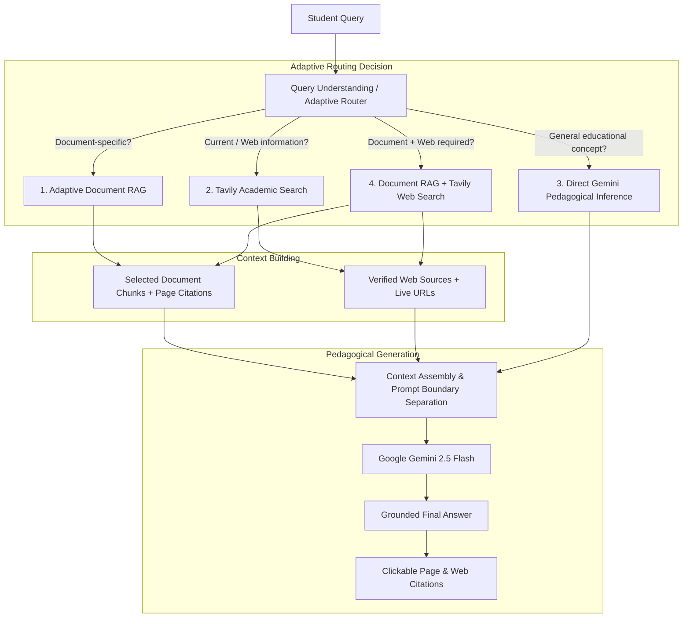
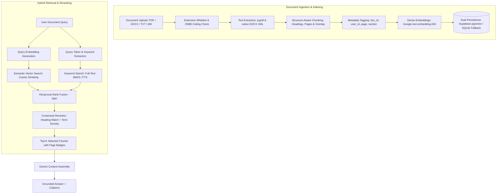
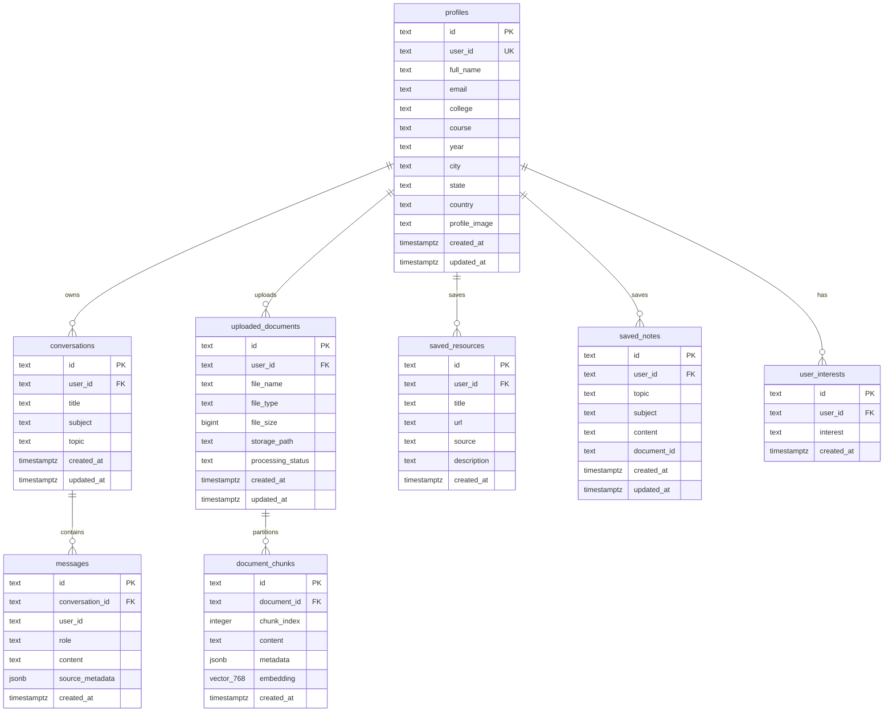

# AI STUDY ASSISTANT

> **"Ask. Understand. Learn. Master."**  
> *Your Personal AI-Powered Academic Companion.*

[](https://ai-study-assistant-five-tau.vercel.app)
[](https://study-assistant-backend-rho.vercel.app)
[](https://supabase.com)
[](https://ai.google.dev/)
[](https://tavily.com/)
[](Backend/tests/)

---

## 1. Project Introduction

### What is AI Study Assistant?
**AI STUDY ASSISTANT** is a full-stack academic platform engineered to assist university and college students with conceptual understanding, revision, exam preparation, and research. The platform combines Google Gemini generative intelligence, Tavily live web retrieval, and an **Adaptive RAG** architecture featuring **Hybrid Retrieval (Dense Vector + Keyword FTS)**, **Reciprocal Rank Fusion (RRF)**, and **Contextual Reranking**.

### What Problem Does It Solve?
* **Generic AI Hallucinations**: Standard LLMs often fabricate citations, formula variants, and outdated library interfaces. The platform uses adaptive grounding—retrieving user lecture notes or verified academic web sources before synthesizing responses.
* **One-Size-Fits-All Explanations**: Students need different depths at different times (e.g., cramming before an exam vs. step-by-step derivation). The assistant provides 6 targeted pedagogical study modes.
* **Fragmented Study Tools**: Consolidates document analysis, contextual Q&A, active-recall quizzes, summary cheat-sheets, and curated resource bookmarks into a unified workspace.

### Who is It For?
* **Undergraduate & Graduate Students**: Enrolled in STEM, Computer Science, Engineering, and foundational sciences.
* **Exam Candidates**: Preparing for university finals, competitive exams, or technical assessments.
* **Independent Scholars**: Conducting research with multi-format study materials (PDF, TXT, MD, DOCX).

---

## 2. How It Works in 60 Seconds

1. **Student submits a question** or uploads course materials (PDF, DOCX, TXT, MD).
2. **Adaptive Router understands the query** and classifies intent into the minimum required pathway (Document RAG, Web Search, Direct Gemini, or Hybrid).
3. **If document-grounded**: The system executes **Hybrid Retrieval** (Dense 768-dim Semantic Vector Search + Keyword Full-Text Search).
4. **Reciprocal Rank Fusion (RRF)** fuses and balances semantic and keyword ranking positions without score distortion.
5. **Contextual Reranker** scores candidate passages against query terms and section headings to select the top-K most relevant chunks.
6. **If external web context is needed**: Tavily retrieves authentic academic links and verified excerpts.
7. **Gemini synthesizes the answer** with clear contextual boundaries, strict zero-fabrication rules, and clickable page-level citations.

---

## 3. Adaptive RAG Architecture

The project implements **Adaptive RAG** with **Hybrid Retrieval + Reciprocal Rank Fusion (RRF) + Contextual Reranking**.

Rather than blindly performing document retrieval on every student query (which increases latency and pollutes foundational questions with unrelated document text), the system determines the optimal processing path based on query understanding:

* **Document-Specific Questions**: Routed to the **Hybrid Document RAG** pipeline.
* **Current / Live Information Queries**: Routed to the **Tavily Academic Web Search** engine.
* **General Pedagogical Concepts**: Answered directly by **Google Gemini** using pedagogical guidelines.
* **Comparative Queries**: Routed to the **Hybrid (Document RAG + Web Search)** pathway.

---

## 4. Complete Adaptive Flow



---

## 5. Detailed Document RAG Pipeline



---

## 6. Hybrid Retrieval Explained

The document retrieval engine uses a complementary two-tier search strategy:

### 1. Semantic (Dense Vector) Search
Uses Google's `text-embedding-004` to generate 768-dimensional float vectors. It captures conceptual intent, synonyms, and paraphrased questions (e.g., matching *"how does memory cleanup work"* to *"garbage collection and reference counting"*).

### 2. Keyword / Full-Text Search
Performs exact lexical and token-frequency matching. Essential for academic documents where students search for exact mathematical formulas, acronyms (`PCB`, `DFS`, `BCNF`), algorithm names (`Bellman-Ford`), or programming variables.

### 3. Reciprocal Rank Fusion (RRF)
Combines the ranked lists from both vector search and keyword search without normalizing raw scores:

$$\text{RRF Score}(d) = \sum_{m \in \{\text{dense}, \text{keyword}\}} \frac{1}{k + \text{rank}_m(d)} \quad (k = 60)$$

RRF ensures documents that perform moderately well in both searches outrank documents that only appear in one.

### 4. Contextual Reranking
Evaluates the top RRF candidate chunks against query terms, heading alignment, and chunk completeness. It selects the top 3–5 highest-yield passages and generates structured citation tags with exact page numbers and document names.

### 5. Strict Document Grounding & Relevance Gating (GroundingEvaluator)
To prevent subtle hallucinations when a student asks about a topic absent from their uploaded document, the system passes candidates through a dedicated `GroundingEvaluator`:
* **Stopword Stripping**: Filters out grammatical boilerplate, interrogatives, and generic academic filler to extract the substantive subject nouns, verbs, and formulas.
* **Three-Tier Classification**: Evaluates substantive overlap and assigns:
  * `STRONGLY_SUPPORTED`: Complete conceptual support found in document chunks $\rightarrow$ generates fully grounded answer with page citations.
  * `PARTIALLY_SUPPORTED`: Core concept present but specific sub-aspect missing $\rightarrow$ answers available facts with explicit caveat regarding missing terms.
  * `NOT_SUPPORTED`: Substantive keywords absent from uploaded document $\rightarrow$ **Immediate refusal** ("I couldn't find this information in the uploaded document..."). **Under zero circumstances does the system fall back to Gemini general knowledge for document-scoped questions.**

---

## 7. Input → Processing → Output

| Input | Processing Pipeline | Output |
|:---|:---|:---|
| **Student question** | Adaptive query router (intent classification) | Selected processing pathway (Doc, Web, Direct, or Hybrid) |
| **Uploaded document** (`.pdf`, `.docx`, `.txt`, `.md`) | File validation $\rightarrow$ structure extraction $\rightarrow$ chunking $\rightarrow$ embeddings | Stored document records with indexed chunk vectors |
| **Document question** | Hybrid retrieval (vector + keyword) $\rightarrow$ RRF $\rightarrow$ contextual reranking $\rightarrow$ `GroundingEvaluator` | Top-K grounded chunks with page numbers OR honest document refusal |
| **Current / web question** | Academic query construction $\rightarrow$ Tavily search API | Authenticated web references with URLs and excerpts |
| **Assembled context** | Pedagogical prompt engineering $\rightarrow$ Google Gemini generation | Grounded Markdown answer with citations and math |
| **Quiz request** | 5 cognitive dimensions $\rightarrow$ Gemini JSON $\rightarrow$ duplicate template rejection | Interactive 5-question MCQ quiz with unique conceptual angles |
| **Quiz verification** | Deterministic answer comparison $\rightarrow$ per-question validation | Score, percentage, mastery evaluation & correct answer key |
| **Notes request** | 6-part academic framework synthesis | Structured revision notes with definitions, code & cheat-sheets |
| **Save note request** | Multi-tenant persistence $\rightarrow$ SQLite / Supabase `saved_notes` | Persisted note entry in student's private Notes Library |

---

## 8. Major System Components

| Component | Technology | Purpose |
|:---|:---|:---|
| **Frontend** | React 18 + Vite | Single Page Application with glassmorphism and mobile drawer |
| **3D Scene** | Three.js | Interactive 3D Digital Brain visualization |
| **Backend API** | FastAPI 0.115+ (Python 3.13) | RESTful API with Pydantic v2 schemas and correlation tracing |
| **AI Generation** | Google Gemini (`gemini-2.5-flash` / fallbacks) | Pedagogical explanation across 6 academic study modes |
| **Embeddings** | Google `text-embedding-004` (768-dim) | Semantic vector embeddings for document chunks |
| **RAG Architecture** | Adaptive RAG | Intent-based routing with minimum resource invocation |
| **Vector Search** | `pgvector` / Python Cosine Engine | Semantic similarity retrieval |
| **Keyword Search** | PostgreSQL FTS / Token Matching | Exact acronym and term retrieval |
| **Ranking Fusion** | Reciprocal Rank Fusion (RRF, $k=60$) | Rank merging between dense and sparse results |
| **Reranker** | Contextual Reranker | Candidate scoring by heading alignment and keyword density |
| **Web Search** | Tavily Python SDK | Real-time academic citations with verified domains |
| **Database** | Supabase Cloud PostgreSQL (RLS) | Primary user, conversation, and document storage |
| **Resilient Fallback** | SQLite (`study_assistant.db`) | Local shadow persistence ensuring zero downtime offline |
| **Authentication** | Supabase Auth + Guest Token Middleware | Google OAuth, Email/Password, and Guest Scholar sessions |

---

## 9. Security & Tenant Isolation

Security is enforced at every layer of the architecture:

* **Tenant Document Isolation**: Document queries strictly filter by `user_id = current_user_id` and `document_id = target_document_id`. User A can never access or retrieve chunks belonging to User B.
* **Database Row-Level Security (RLS)**: PostgreSQL policies on Supabase restrict queries via `auth.uid()::text = user_id`.
* **Zero Secret Exposure**: `GEMINI_API_KEY`, `TAVILY_API_KEY`, and `SUPABASE_SECRET_KEY` are stored exclusively in backend environment variables and are never transmitted to the browser or committed to Git.
* **File Upload Constraints**: Files are validated against an extension whitelist (`.pdf`, `.docx`, `.txt`, `.md`) and a 25 MB ceiling. Filenames are sanitized against path traversal (`../`) before disk writes.
* **Prompt Boundary Protection**: User-uploaded text is clearly demarcated within triple-quote context boundaries with explicit instructions preventing prompt injection and hallucination.

---

## 10. Database Schema (Entity-Relationship)



---

## 11. User Flows

### A. Normal Question Flow
```
Student Question → Adaptive Router (Identifies General Academic Intent) → Gemini Pedagogical Engine → Structured Markdown Answer
```

### B. Document Question Flow
```
Document Upload → Validation → Chunking → Embeddings → Hybrid Retrieval (Vector + Keyword) → RRF ($k=60$) → Contextual Reranking → Gemini Grounded Synthesis → Answer + Page Citations
```

### C. Web Question Flow
```
Student Question → Adaptive Router (Identifies Temporal/Web Requirement) → Tavily Academic Search → Gemini Synthesis → Answer + Live Reference Badges
```

### D. Hybrid Document + Web Question Flow
```
Comparative Question → Adaptive Router (Identifies Hybrid Requirement) → Document RAG + Tavily Search → Joint Context Assembly → Gemini Synthesis → Comparative Grounded Answer
```

### E. Study Tools Flow (Quizzes & Notes)
```
Topic Selection → Mode Selection → Pydantic Schema Validation → Gemini Structured Generation → Interactive Quiz UI / Revision Notes
```

---

## 12. Technology Stack

* **Frontend**: React 18, Vite 6, React Router 6, Lucide Icons, KaTeX, React Markdown, Three.js
* **Backend**: FastAPI 0.115, Uvicorn, Pydantic v2, Pydantic Settings, `httpx`, `pypdf`
* **AI & Cognition**: Google GenAI SDK (`gemini-2.5-flash`, fallback models), Google Embeddings (`text-embedding-004`)
* **Search Grounding**: Tavily Search Engine Python SDK
* **Database & Storage**: Supabase PostgreSQL 15, `pgvector`, SQLite 3 (shadow fallback)
* **Authentication**: Supabase JWT / Guest Scholar Token Guard
* **Testing**: Pytest 9, pytest-asyncio, FastAPI TestClient

---

## 13. Setup & Installation

### Prerequisites
* Python 3.10+
* Node.js 18+ and npm
* Google Gemini API Key
* Tavily Search API Key (optional, for web grounding)
* Supabase Account (optional; falls back to SQLite if absent)

### 1. Clone the Repository
```bash
git clone https://github.com/Ashish10102006/ai-study-assistant.git
cd ai-study-assistant
```

### 2. Backend Setup
```bash
cd Backend
python -m venv venv

# Windows
.\venv\Scripts\activate
# Linux/macOS
source venv/bin/activate

pip install -r requirements.txt
```

Create `Backend/.env` (use placeholder values, never commit real keys):
```env
GEMINI_API_KEY=your_gemini_api_key_here
TAVILY_API_KEY=your_tavily_api_key_here
SUPABASE_URL=https://your-project-id.supabase.co
SUPABASE_PUBLISHABLE_KEY=your_supabase_publishable_key
SUPABASE_SECRET_KEY=your_supabase_service_role_key
APP_URL=http://localhost:5173
PORT=8000
HOST=0.0.0.0
```

Run the backend server:
```bash
uvicorn main:app --reload --port 8000
```

### 3. Frontend Setup
```bash
cd ../Frontend
npm install
```

Create `Frontend/.env`:
```env
VITE_API_URL=http://localhost:8000
VITE_SUPABASE_URL=https://your-project-id.supabase.co
VITE_SUPABASE_ANON_KEY=your_supabase_anon_key
```

Run the frontend development server:
```bash
npm run dev
```

---

## 14. Testing & Verification

The test suite validates unit components, adaptive routing, hybrid retrieval, reciprocal rank fusion, contextual reranking, and data isolation.

Run the test suite:
```bash
cd Backend
pytest tests/test_adaptive_rag.py tests/test_documents.py tests/test_ai.py tests/test_api.py -v
```

### Test Verification Results
* **`tests/test_adaptive_rag.py`**: 10 passed (Router, Embeddings, Chunking, RRF, Reranker, Tenant Isolation, API)
* **`tests/test_document_grounding.py`**: 5 passed (Strict Grounding Evaluator, Stopword Stripping, Classification, Tenant Gating)
* **`tests/test_quiz_integrity.py`**: 3 passed (Cognitive Diversity, Option Keys, Answer Integrity, Scoring API)
* **`tests/test_notes_persistence.py`**: 2 passed (Saved Notes CRUD, Multi-Tenant Isolation, Input Validation)
* **`tests/test_documents.py`**: 2 passed (File Type Validation, Structure-Aware Chunking)
* **`tests/test_ai.py`**: 2 passed (Gemini Client Initialization, Prompt Formatting)
* **`tests/test_api.py`**: 5 passed (Health Diagnostics, Root, Conversations, Profile Updates)
* **`tests/test_search.py`**: 1 passed (Tavily Academic Search Engine)
* **`tests/test_pre_github_verification.py`**: 9 passed, 5 skipped (Full End-to-End Regression Baseline)
* **Total Automated Test Suite**: **39 Passed, 5 Skipped, 0 Failed**
* **Frontend Production Build**: **Passed** (`vite build` compiled 1,954 modules in 4.49s)

---

## 15. Repository Structure

```
ai-study-assistant/
├── Backend/
│   ├── .python-version         # Pinned Python 3.13 runtime for Vercel
│   ├── vercel.json             # Modern Vercel Serverless Function configuration
│   ├── app/
│   │   ├── ai/                 # Gemini service & prompt generation
│   │   │   └── gemini_service.py
│   │   ├── config/             # Pydantic environment configuration
│   │   │   └── settings.py
│   │   ├── documents/          # Structure-aware document processor
│   │   │   └── processor.py
│   │   ├── middleware/         # Auth guard & Guest token sanitizer
│   │   │   └── auth.py
│   │   ├── models/             # Pydantic request/response schemas
│   │   │   └── schemas.py
│   │   ├── rag/                # Adaptive RAG core module
│   │   │   ├── __init__.py
│   │   │   ├── router.py       # Query understanding & adaptive intent router
│   │   │   ├── embeddings.py   # text-embedding-004 & fallback embedding service
│   │   │   ├── retriever.py    # Hybrid retriever (Dense + Keyword FTS) & RRF
│   │   │   └── reranker.py     # Contextual reranker & citation builder
│   │   ├── routes/             # FastAPI endpoints (/ask, /chat, /documents)
│   │   │   └── api.py
│   │   ├── search/             # Tavily search integration
│   │   │   └── tavily_service.py
│   │   └── services/           # Dual-driver persistence (Supabase + SQLite)
│   │       ├── storage_service.py
│   │       └── supabase_client.py
│   ├── tests/                  # Automated test suite
│   ├── main.py                 # FastAPI application entrypoint
│   └── requirements.txt        # Python dependencies
├── Database/
│   ├── schema.sql              # Production Supabase PostgreSQL schema + pgvector
│   ├── fix_permissions.sql
│   └── seed.sql
├── Frontend/
│   ├── src/                    # React 18 + Vite frontend
│   ├── vercel.json             # SPA client rewrite rules
│   ├── package.json
│   └── vite.config.js
├── render.yaml                 # Render cloud web service blueprint
├── .gitignore                  # Strict credential, cache & db ignore rules
└── README.md
```

---

## 16. Technical Differentiation

Unlike standard naive RAG implementations that split documents into arbitrary character slices and run basic cosine similarity for every query regardless of context, AI Study Assistant integrates:

1. **Adaptive Intent Routing**: Avoids unnecessary retrieval latency and hallucination by differentiating between document-grounded, web-grounded, and foundational academic queries.
2. **Dual-Track Hybrid Retrieval**: Marries 768-dimensional dense semantic vectors with lexical keyword full-text matching to capture both conceptual queries and exact academic formulas/acronyms.
3. **Reciprocal Rank Fusion (RRF)**: Merges heterogeneous scoring spaces mathematically without arbitrary score normalization weights.
4. **Contextual Reranking**: Evaluates query term density and section heading matches to ensure the highest-yield excerpts are prioritized.
5. **Dual Persistence Resilience**: Ensures zero crashes by automatically falling back to an embedded SQLite shadow database when cloud connections are unavailable.

---

## 17. Deployment & Live Links

* **Production Frontend**: [https://ai-study-assistant-five-tau.vercel.app](https://ai-study-assistant-five-tau.vercel.app)
* **Production Backend**: [https://study-assistant-backend-rho.vercel.app](https://study-assistant-backend-rho.vercel.app)
* **GitHub Repository**: [https://github.com/Ashish10102006/ai-study-assistant](https://github.com/Ashish10102006/ai-study-assistant)

### Deployment Architecture:
* **Frontend (Vercel)**: React + Vite Single Page Application configured with SPA route rewrites in `Frontend/vercel.json`.
* **Backend (Vercel Serverless Functions)**: Python 3.13 FastAPI application configured in `Backend/vercel.json` using modern zero-config rewrites and function maxDuration, with automatic `/tmp` uploads handling in serverless environments.
* **Backend (Alternative: Render Web Service)**: Full containerized deployment blueprint via `render.yaml` with managed auto-deploys and environment synchronization.

