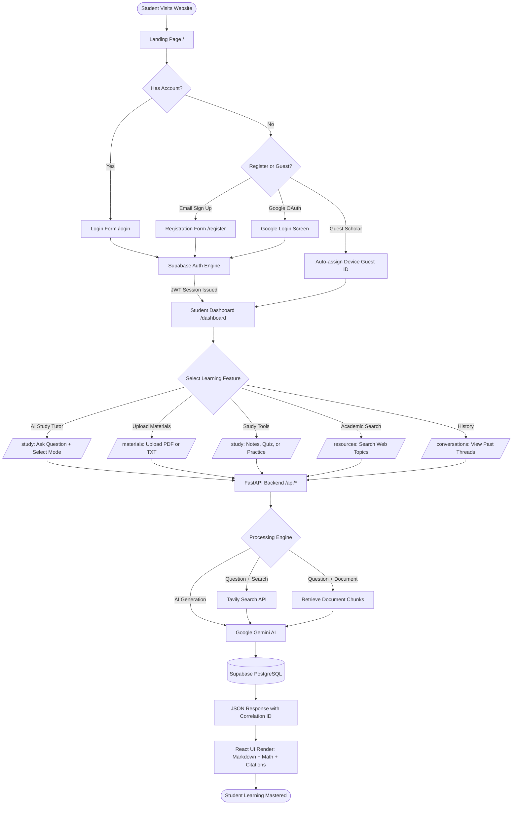
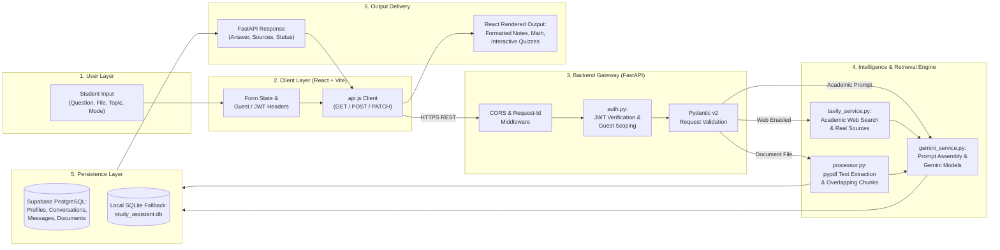
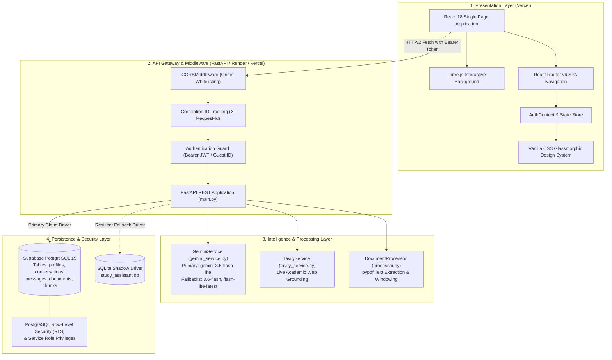
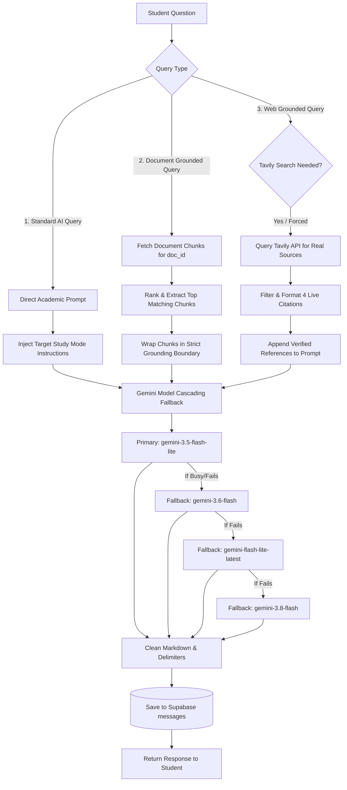
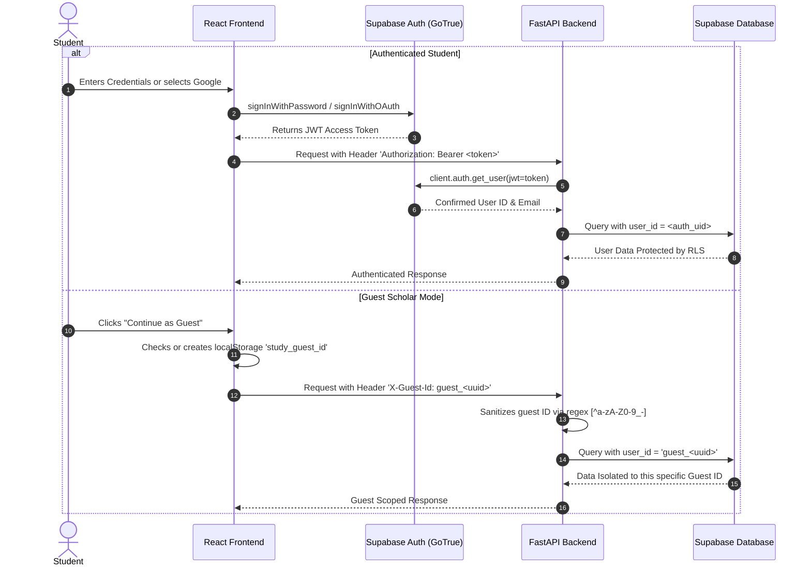
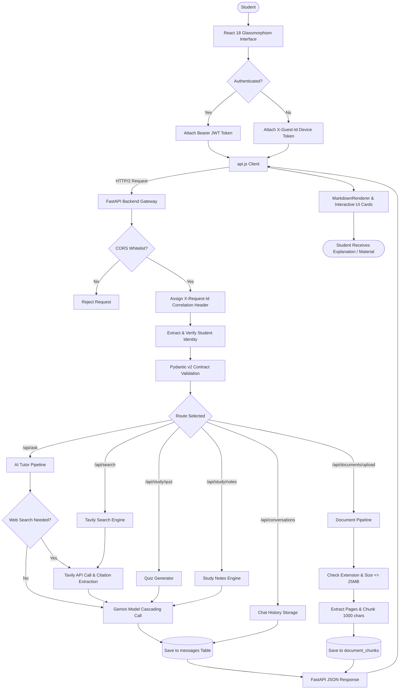

# AI STUDY ASSISTANT

> **"Ask. Understand. Learn. Master."**  
> *Your Personal AI-Powered Academic Companion.*

[](https://ai-study-assistant-five-tau.vercel.app)
[](https://study-assistant-backend-rho.vercel.app)
[](https://supabase.com)
[](https://ai.google.dev/)
[](https://tavily.com/)
[](Backend/tests/)

---

## 1. Project Introduction

### What is AI Study Assistant?
**AI STUDY ASSISTANT** is a full-stack, cloud-deployed educational platform engineered to help university and high school students master complex academic topics. It combines state-of-the-art generative AI (**Google Gemini**) with real-time web search (**Tavily**) and grounded document processing (**PDF/Text Ingestion**) to deliver rigorous, accurate, and structured academic explanations.

### What Problem Does It Solve?
* **Generic AI Hallucinations**: Standard chatbots frequently invent plausible-sounding formulas, paper citations, and outdated information. AI Study Assistant solves this by strictly grounding answers in uploaded documents or verifying them against live academic sources.
* **One-Size-Fits-All Explanations**: Students learn differently depending on their goals (e.g., cramming for an exam vs. understanding underlying mechanics). The platform provides 6 targeted pedagogical study modes tailored to student needs.
* **Fragmented Study Tools**: Instead of juggling separate apps for notes, quiz creation, flashcards, and search engines, students have an all-in-one workspace with synchronized conversation history and cloud storage.

### Who is It For?
* **Undergraduate & Graduate Students**: Tackling engineering, computer science, mathematics, natural sciences, and humanities.
* **Self-Learners & Independent Researchers**: Exploring technical documentation and foundational subjects.
* **Exam Candidates**: Preparing for university midterms, finals, or technical interviews using targeted revision cheat-sheets and quizzes.

---

## 2. What the User Can Do

Every feature in AI Study Assistant is built around clear student workflows:

| Feature | User Action | System Process | User Result |
|---|---|---|---|
| **Account Creation & Sign In** | Enters email & password or clicks **Continue with Google** | Supabase Auth validates credentials, creates user profile, and issues JWT | Instant access to student workspace with persistent session across devices |
| **Guest Scholar Mode** | Clicks **Continue as Guest Scholar** without registering | Frontend generates isolated device UUID (`guest_<uuid>`) sent via `X-Guest-Id` | Immediate access to tutor; data remains isolated to that browser session |
| **Ask Academic Questions** | Types a question and selects subject (e.g. Computer Science) | Backend builds structured pedagogical prompt and queries Gemini API | Structured Markdown answer with code blocks, math formulas, and key concepts |
| **Select Study Mode** | Selects 1 of 6 modes (`Simple`, `Detailed`, `Step-by-Step`, `Examples`, `Revision`, `Exam-Oriented`) | System instruction is injected into Gemini prompt directing tone and structure | Explanations adapt to desired learning depth without fluff |
| **Custom Academic Topics** | Enters custom topic (e.g. *Bellman-Ford Dynamic Programming*) | Topic is validated and indexed into prompt and conversation title | Precision-targeted academic explanation for specialized coursework |
| **Document Upload** | Uploads `.pdf`, `.txt`, or `.md` study material (up to 25 MB) | Backend validates file, extracts text via `pypdf`, splits into overlapping chunks, and stores in database | Document dashboard card with chunk count, page breakdown, and status badge |
| **Document-Grounded Q&A** | Selects uploaded document and asks a specific question | Backend retrieves top relevant text chunks and injects them as strict reference context | AI answers strictly from the document content with zero external hallucination |
| **Generate Study Notes** | Enters a topic and clicks **Generate Study Notes** | Backend synthesizes comprehensive 6-part academic revision notes | Publication-grade Markdown notes with theory, algorithms, pitfalls, and checklists |
| **Interactive Quizzes** | Selects topic, count, and difficulty level | Backend instructs Gemini to return strict JSON matching schema; parses into quiz cards | Interactive multiple-choice quiz with real-time grading, distractors, and explanations |
| **Practice Questions** | Chooses topic and clicks **Practice Questions** | Gemini generates multi-tier conceptual and problem-solving exercises | Structured problem sets with revealable progressive hints and complete model answers |
| **Web-Grounded Learning** | Toggles **Web Search** or asks about latest documentation | Backend queries Tavily Search API, extracts top 4 verified links, and adds context to AI | Response includes verifiable academic citations (title, URL, domain snippet) |
| **Conversation History** | Clicks **Chat History** or browses past threads on Dashboard | Backend queries Supabase `conversations` and `messages` tables | Full access to past study sessions, follow-up Q&A threads, and search filtering |
| **Save Resources** | Clicks bookmark icon on any search reference | Backend stores record in `saved_resources` table with URL and metadata | Curated reference library accessible on the **Saved Resources** page |
| **Student Profile** | Updates college, degree course, year, and location on `/profile` | Backend updates `profiles` table in Supabase PostgreSQL | Personalized experience with college context and Google avatar sync |

---

## 3. Complete Website User Flow



---

## 4. Complete Data Flow — Input to Output



### Data Transformations Across the Pipeline:
1. **Raw Text Input**: Sanitized in Pydantic models (`AskRequest`, `StudyQuizRequest`), stripped of trailing whitespace, bounded to length constraints.
2. **Uploaded Document**: Byte stream read in memory &rarr; validated against allowed extensions (`.pdf`, `.txt`, `.md`) and size ceiling (25 MB) &rarr; written to temporary storage &rarr; parsed into clean page strings &rarr; partitioned into 1,000-character windows with 150-character overlap &rarr; stored with integer index and document reference.
3. **Academic Search Query**: Natural language question evaluated by `should_search()` heuristic &rarr; transformed into keyword search string &rarr; sent to Tavily &rarr; normalized into clean `SourceItem` objects (title, URL, domain, description) &rarr; injected into Gemini prompt context.
4. **AI Generation**: Prompt constructed with strict system instructions, target study mode guidelines, document context (if linked), recent chat history (last 4 turns), and web citations &rarr; dispatched to Gemini &rarr; validated for non-empty text &rarr; stored in database &rarr; returned as structured JSON.

---

## 5. Input &rarr; Processing &rarr; Output Matrix

| User Input | Backend Processing | External Services Used | Output Delivered to Student |
|---|---|---|---|
| Question: *"Explain QuickSort algorithm"* + Mode: `simple` | Validates input, builds beginner-friendly prompt with real-world analogy | Google Gemini (`gemini-3.5-flash-lite`) | Formatted explanation with everyday partition analogy and clean Markdown code |
| Question: *"What is time complexity of Dijkstra?"* + Web Search: `true` | Runs query heuristic, queries Tavily for authoritative resources, builds grounded prompt | Tavily Search API + Google Gemini | Theoretical complexity breakdown + verified documentation links with domain badges |
| Upload: `Syllabus_CS301.pdf` (1.2 MB) | Validates MIME type, extracts text pages via `pypdf`, creates 1,000-char chunks | None (Local backend document processor) | Upload confirmation card showing chunk count, file size, and "COMPLETED" status |
| Question: *"When is the final exam according to my uploaded syllabus?"* | Retrieves top 5 matching text chunks from database for `doc_id`, injects into prompt | Supabase Database + Google Gemini | Direct answer quoted from syllabus text with page number citation |
| Topic: *"Graph Neural Networks"* &rarr; Generate Quiz | Dispatches structured JSON schema prompt requesting 5 multiple-choice questions | Google Gemini | 5 interactive multiple-choice cards with selectable options, instant grading, and explanations |
| Topic: *"Operating System Deadlocks"* &rarr; Generate Notes | Executes comprehensive publication-grade prompt with 6 strict academic sections | Google Gemini | Full revision document: Overview, Principles, Algorithms, Case Studies, Pitfalls, and Exam Checklist |

---

## 6. Real Example User Journeys

### Example 1 — Student Asks a Question with "Exam-Oriented" Mode
1. **Action**: The student opens the tutor page, selects **Computer Science**, enters topic *"B-Trees"*, types *"Explain B-Tree insertion and node splitting"*, and selects the **Exam-Oriented** mode.
2. **Frontend**: Captures input, adds `X-Guest-Id` or Bearer JWT token, and sends `POST /api/ask`.
3. **Backend**: 
   * `auth.py` validates identity.
   * `storage_service.py` creates a new conversation entry in Supabase.
   * `storage_service.py` records the student's question under `messages` with role `USER`.
   * `gemini_service.py` injects the university grading rubric prompt.
4. **AI Execution**: Gemini generates university exam-style headers: *Definition*, *Properties*, *Step-by-Step Splitting Algorithm*, *Time Complexity ($O(\log n)$)*, and *Common Exam Mistakes*.
5. **Storage & Delivery**: The assistant answer is saved to Supabase with role `ASSISTANT`. The frontend receives the response in ~4 seconds and renders syntax-highlighted code and KaTeX formulas.

---

### Example 2 — Student Uploads Course Notes and Asks Grounded Questions
1. **Action**: The student drags `MachineLearning_Lecture4.pdf` onto the **Study Materials** page.
2. **Upload Processing**:
   * Frontend sends `POST /api/documents/upload` via `multipart/form-data`.
   * Backend checks file extension (`.pdf`) and ensures file size $\le 25\text{ MB}$.
   * Filename is sanitized against path traversal (`timestamp_safe_name.pdf`).
   * `processor.py` extracts text across all pages and splits content into indexed chunks.
   * Chunks are batch-saved into the Supabase `document_chunks` table.
3. **Grounded Q&A**:
   * On the document detail page, the student asks: *"What loss function was recommended in slide 12?"*
   * Backend runs keyword relevance scoring across the document's stored chunks.
   * Top matching chunks are provided to Gemini wrapped in `<uploaded_document_context>` delimiters.
   * Gemini is strictly instructed: *"Answer only based on the document context. If not mentioned, state that it is not present."*
4. **Result**: The student gets an accurate answer citing the exact slide/chunk without external hallucination.

---

### Example 3 — Student Verifies Latest Framework Documentation
1. **Action**: The student asks *"How do I configure CORS in FastAPI with modern allow_origins?"* and toggles **Web Search**.
2. **Backend Detection**: `tavily_service.py` detects the search intent and executes `tavily.search("FastAPI modern allow_origins CORS tutorial", max_results=4)`.
3. **Source Validation**: Tavily returns verified URLs from `fastapi.tiangolo.com`.
4. **Synthesis**: Gemini incorporates the live documentation snippets into the code example.
5. **Result**: The UI displays the code explanation alongside clickable citation chips linking directly to official documentation.

---

## 7. System Architecture



### Layer Descriptions:
* **Presentation Layer**: Client-side React 18 SPA compiled with Vite. Features Three.js particle backgrounds, responsive mobile-first CSS custom properties, and instant optimistic UI states.
* **Gateway & Middleware**: FastAPI server running asynchronous request handling, CORS origin headers, correlation IDs for distributed debugging, and token extraction.
* **Intelligence Layer**: Independent service singletons for generative AI, web search, and document ingestion.
* **Persistence Layer**: Cloud-managed PostgreSQL on Supabase protected by Row-Level Security (RLS). Automatically falls back to an embedded SQLite database if credentials or network are unavailable.

---

## 8. Technology Stack

| Layer | Technology | Version | Purpose in Application |
|---|---|---|---|
| **Frontend Framework** | React | `^18.3.1` | Declarative UI component hierarchy and reactive state management |
| **Build Tool** | Vite | `^6.4.3` | Ultra-fast local development and optimized production chunk bundling |
| **Styling** | Vanilla CSS | Custom CSS3 | Tailored glassmorphism design system without heavy framework overhead |
| **Icons** | Lucide React | `^0.344.0` | Crisp, scalable SVG academic and UI icons |
| **Animations & 3D** | Three.js | `^0.160.0` | Subtle, performant interactive particle field canvas on landing page |
| **Routing** | React Router DOM | `^6.22.0` | Client-side SPA routing with protected navigation guards |
| **Backend Framework** | FastAPI | `>=0.115.0` | Asynchronous Python web API framework with automatic OpenAPI docs |
| **ASGI Server** | Uvicorn | `>=0.30.0` | High-performance asynchronous server for FastAPI |
| **Data Validation** | Pydantic v2 | `>=2.8.0` | Strict type validation and schema enforcement for all requests/responses |
| **AI SDK** | Google GenAI SDK | `>=2.0.0` | Official client for Google Gemini models with explicit AFC control |
| **Search SDK** | Tavily Python | `>=0.5.0` | AI-optimized search engine client for live academic citations |
| **PDF Processing** | pypdf | `>=5.0.0` | Pure-python PDF text extraction, page parsing, and inspection |
| **Cloud Database** | Supabase PostgreSQL | `15.x` | Primary cloud database with Row-Level Security and auth triggers |
| **Cloud Auth** | Supabase Auth (GoTrue) | `v1` | OAuth2 (Google PKCE), JWT tokens, and user session management |
| **Testing** | pytest & pytest-asyncio | `>=8.0.0` | Automated backend testing suite and end-to-end integration tests |

---

## 9. Frontend Architecture & Flow

```
[Browser Window]
       │
       ▼
[main.jsx] ─── Mounts root with BrowserRouter and AuthProvider
       │
       ▼
[App.jsx] ──── Declares route table (Public + ProtectedRoute guards)
       │
       ├── Public Routes:    / (Home), /login, /register, /resources
       └── Protected Routes: /dashboard, /study, /materials, /profile, /conversations, /saved
       │
       ▼
[Pages & Components]
       ├── StudyAssistant.jsx ─── Interactive prompt input, modes, streaming output
       ├── DocumentDetail.jsx ─── Chunk previewer and grounded document Q&A
       └── MarkdownRenderer.jsx ─ Formatted text with PrismJS syntax & KaTeX math
       │
       ▼
[services/api.js] ────────────── Centralized HTTP client:
                                  • Injects Bearer token from Supabase session
                                  • Injects X-Guest-Id for unauthenticated scholars
                                  • Auto-selects production or localhost API base URL
                                  • Standardizes network error handling
```

---

## 10. Backend Architecture & Flow

```
[Incoming HTTP Request]
       │
       ▼
[main.py: CORSMiddleware] ─────── Checks origin against allowed origins list
       │
       ▼
[main.py: Correlation MW] ────── Assigns or forwards X-Request-Id header
       │
       ▼
[app/middleware/auth.py] ─────── Extracts Supabase JWT or guest device token:
                                  • Bearer Token: Verifies via Supabase Auth API
                                  • No Token: Scopes user to guest_<device_id>
       │
       ▼
[app/models/schemas.py] ──────── Pydantic models validate request body and types
       │
       ▼
[app/routes/api.py] ──────────── Dispatches to appropriate route handler
       │
       ├── /api/ask ───────────── Orchestrates Tavily search, context, and Gemini
       ├── /api/documents/upload  Validates file, invokes processor.py, saves to DB
       ├── /api/study/* ───────── Generates notes, quizzes, and practice problems
       └── /api/conversations ─── CRUD operations for student chat threads
       │
       ▼
[Response JSON Serialization] ── Serialized using Pydantic response models & 200 OK
```

---

## 11. AI & Grounded Retrieval (RAG) Pipeline

AI Study Assistant uses three distinct operational workflows for answering questions:



* **Standard AI Query**: When learning general principles, Gemini uses its foundational knowledge structured by the chosen study mode.
* **Document-Grounded Query**: When a document is attached, text chunks are extracted from the database and supplied inside strict context fences. The model is penalized if it generates information outside the uploaded material.
* **Web-Grounded Query**: When live documentation, standards, or current tools are queried, Tavily searches the live web, returns verified links, and Gemini cites them directly.

---

## 12. Document Processing & Ingestion

The platform handles document ingestion with strict validation and memory safeguards:

1. **Upload Validation**:
   * Extensions permitted: `.pdf`, `.txt`, `.md`.
   * Size ceiling: **25 MB** maximum. Empty files ($0\text{ bytes}$) are rejected immediately with HTTP 400.
2. **Path Traversal Defense**:
   * Filenames are stripped of path characters: `raw_name = Path(file.filename).name`.
   * Special characters are replaced with safe characters: `re.sub(r'[^a-zA-Z0-9_.-]', '_', raw_name)`.
   * Files are stored with an ISO timestamp prefix to prevent collisions.
3. **Extraction**:
   * **PDF**: Extracted page-by-page using `pypdf.PdfReader` with whitespace normalization.
   * **TXT / MD**: Read directly using UTF-8 with ignore-errors fallback.
4. **Chunking**:
   * Chunk size: **1,000 characters**.
   * Overlap: **150 characters** (preserves sentence context across chunk boundaries).
   * Stored in `document_chunks` table with `chunk_index`, page metadata, and document reference.

---

## 13. Authentication & Security Architecture



### Security Controls Implemented:
* **Private API Keys Stored Server-Side Only**: `GEMINI_API_KEY`, `TAVILY_API_KEY`, and `SUPABASE_SECRET_KEY` are never bundled into the frontend build. They exist solely in backend environment variables.
* **Row-Level Security (RLS)**: Every table in Supabase has RLS enabled. Users can only query rows where `user_id = auth.uid()::text`.
* **CORS Whitelisting**: Strict origin checking in `main.py` allowing only authorized frontend origins (`https://ai-study-assistant-five-tau.vercel.app` and local dev ports).
* **Correlation IDs**: Every incoming request receives a unique `X-Request-Id` header (either forwarded from client or generated via `uuid4()`) for transparent log tracing.

---

## 14. Database & Storage Architecture

The application uses **Supabase PostgreSQL** as its primary cloud data store with an automated **SQLite Shadow Fallback** for local resilience:

```
                          ┌───────────────────────────┐
                          │   FastAPI Backend Server  │
                          └─────────────┬─────────────┘
                                        │
                    ┌───────────────────┴───────────────────┐
                    ▼                                       ▼
        [Primary Cloud Driver]                  [Resilient Shadow Driver]
      Supabase PostgreSQL 15                   Local SQLite (study_assistant.db)
  • profiles (user demographic data)       • Mirror schema of all Supabase tables
  • conversations (study chat threads)     • Activates automatically if cloud
  • messages (individual Q&A entries)        credentials are unconfigured
  • uploaded_documents (file records)      • Enables offline local testing
  • document_chunks (indexed text)         • Transparent fallback logging
  • saved_resources (bookmarked links)
```

### Database Tables:
1. **`profiles`**: Stores full name, email, college, course, study year, and location. Automatically populated on registration via the `handle_new_user()` trigger.
2. **`conversations`**: Groups study interactions with titles, academic subjects, and timestamps.
3. **`messages`**: Individual messages labeled with roles (`USER`, `ASSISTANT`, `SYSTEM`) and metadata.
4. **`uploaded_documents`**: Records filename, MIME type, size, storage path, and processing status (`UPLOADED`, `PROCESSING`, `COMPLETED`, `FAILED`).
5. **`document_chunks`**: Stores indexed text slices with document references for grounded context retrieval.
6. **`saved_resources`**: Stores bookmarked URLs, titles, and sources curated by the student.
7. **`study_sessions`**: Tracks topic coverage and study duration.
8. **`user_interests`**: Stores student academic tags and subject interests.
9. **`search_history`**: Maintains history of academic search queries.

---

## 15. API Endpoint Specifications

The backend exposes 24 production REST endpoints:

### System & Diagnostics
* `GET /api/health`: Health diagnostics returning configuration status of Supabase, Gemini, Tavily, and storage readiness without revealing secret values.

### Academic Assistant & Q&A
* `POST /api/ask`: Core tutor endpoint. Accepts question, subject, topic, study mode, document link, and web search flag. Returns structured explanation and citations.
* `POST /api/chat`: Follow-up message endpoint within an existing conversation thread.

### Study Threads & History
* `GET /api/conversations`: Returns all conversation threads for the current user.
* `POST /api/conversations`: Creates a new study conversation thread.
* `GET /api/conversations/{id}`: Retrieves a full conversation thread and its complete message history.
* `PATCH /api/conversations/{id}`: Updates conversation title or topic.
* `DELETE /api/conversations/{id}`: Deletes a conversation thread and cascades deletion to its messages.

### Documents & Materials
* `POST /api/documents/upload`: Uploads and processes `.pdf`, `.txt`, or `.md` files.
* `GET /api/documents`: Lists all uploaded documents for the active user.
* `GET /api/documents/{id}`: Retrieves document details, chunk count, and preview chunks.
* `DELETE /api/documents/{id}`: Deletes document record and associated text chunks.
* `POST /api/documents/{id}/ask`: Performs grounded Q&A strictly against the specified document.

### Study Tools
* `POST /api/study/summarize`: Generates high-retention academic summaries of provided text.
* `POST /api/study/notes`: Synthesizes comprehensive 6-part structured revision notes.
* `POST /api/study/quiz`: Generates structured multiple-choice quizzes (JSON) with explanations.
* `POST /api/study/questions`: Generates conceptual and problem-solving practice questions with hints.

### Search & Resources
* `POST /api/search`: Queries Tavily for live academic sources and verified documentation.
* `GET /api/resources`: Returns curated academic learning resources.
* `POST /api/resources/save`: Bookmarks an academic resource to student's library.
* `GET /api/resources/saved`: Retrieves all saved resources for the current user.
* `DELETE /api/resources/saved/{id}`: Removes a saved resource from the library.

### Student Profile
* `GET /api/profile`: Retrieves current student profile.
* `PATCH /api/profile`: Updates profile fields (college, course, year, location).

---

## 16. Repository Structure

```
ai-study-assistant/
├── README.md                           # Master Project Documentation & Flowcharts
├── render.yaml                         # Production Render deployment blueprint
├── docs/                               # Formal System Analysis & Engineering Suite
│   ├── ARCHITECTURE.md                 # Macro-Archetypes, AI/RAG Pipeline, Decision Tree
│   ├── DATABASE_AND_API_SCHEMA.md      # Full DB schema, ER diagram, & endpoint catalog
│   ├── FAILURE_MODES_AND_RESILIENCE.md # 20 Edge Scenarios (A-T) and Recovery Procedures
│   ├── PROBLEM_ANALYSIS.md             # Decomposition, Constraints, 12-Criterion Matrix
│   ├── SECURITY_AND_SCALABILITY.md     # STRIDE Threat Model, 4-Tier Scaling Roadmap
│   └── TESTING_STRATEGY.md             # Test Methodology, Pytest Suite, Build Audits
├── Database/
│   ├── schema.sql                      # Production Supabase DDL, RLS, & Role Grants
│   ├── fix_permissions.sql             # Standalone grant privileges script for Supabase
│   ├── seed.sql                        # Sample academic subjects and study starter data
│   └── README.md                       # Database setup and migration instructions
├── Backend/
│   ├── main.py                         # FastAPI App, CORS, & Correlation Middleware
│   ├── vercel.json                     # Serverless configuration (maxDuration: 60s)
│   ├── Dockerfile                      # Container build definition for Docker / HuggingFace
│   ├── Procfile                        # Process file for Render / Heroku deployments
│   ├── requirements.txt                # Python backend dependencies
│   ├── .env.example                    # Backend environment template (safe placeholders)
│   ├── app/
│   │   ├── config/settings.py          # Pydantic v2 Settings & diagnostic status
│   │   ├── models/schemas.py           # Pydantic request/response data contracts
│   │   ├── middleware/auth.py          # Supabase JWT & Guest ID authentication guard
│   │   ├── routes/api.py               # REST API route handlers
│   │   ├── services/
│   │   │   ├── storage_service.py      # Dual-Driver Storage (Supabase + SQLite fallback)
│   │   │   └── supabase_client.py      # Supabase admin client & JWT token verifier
│   │   ├── ai/gemini_service.py        # Gemini API client with fallback cascade & AFC off
│   │   ├── search/tavily_service.py    # Tavily academic web search client & heuristics
│   │   └── documents/processor.py      # pypdf text extraction, chunking, and validation
│   └── tests/                          # Automated backend test suite
│       ├── test_ai.py                  # Gemini prompt formatting & service tests
│       ├── test_api.py                 # Core API endpoints & conversation flow tests
│       ├── test_documents.py           # PDF/text extraction & chunking validation
│       ├── test_search.py              # Tavily heuristic search trigger tests
│       └── test_pre_github_verification.py # Deep system integration test suite
└── Frontend/
    ├── index.html                      # HTML5 entry with Outfit & Inter typography
    ├── package.json                    # Frontend dependencies & scripts
    ├── vite.config.js                  # Vite bundler configuration & asset splitting
    ├── vercel.json                     # SPA client-side route rewrites for Vercel
    ├── .env.example                    # Frontend environment template (safe placeholders)
    └── src/
        ├── main.jsx                    # Application entry point
        ├── App.jsx                     # Route table & ProtectedRoute declarations
        ├── contexts/AuthContext.jsx    # Supabase authentication provider & Google OAuth
        ├── services/
        │   ├── api.js                  # Centralized fetch client with auth injection
        │   └── supabase.js             # Supabase browser client initialization
        ├── styles/
        │   └── variables.css           # Glassmorphism theme, colors, and breakpoints
        ├── components/
        │   ├── Navbar.jsx              # Responsive navigation header
        │   ├── Footer.jsx              # Application footer
        │   ├── ProtectedRoute.jsx      # Authentication route guard
        │   └── MarkdownRenderer.jsx    # Syntax highlighted code & math rendering
        └── pages/
            ├── Home.jsx                # Landing page with 3D canvas and quick query
            ├── Login.jsx               # Sign in page (Google OAuth + Email)
            ├── Register.jsx            # Account registration page
            ├── Dashboard.jsx           # Student overview & quick action launcher
            ├── StudyAssistant.jsx      # Core tutor chat interface & study modes
            ├── ConversationsList.jsx   # All conversation threads catalog
            ├── ConversationView.jsx    # Individual study thread viewer & follow-ups
            ├── StudyMaterials.jsx      # Document upload & management workspace
            ├── DocumentDetail.jsx      # Document chunk inspector & grounded Q&A
            ├── LearningResources.jsx   # Academic search & resource catalog
            ├── SavedResources.jsx      # Student bookmarked links collection
            └── Profile.jsx             # Student profile editor & credentials
```

---

## 17. Environment Variables Configuration

### Frontend Variables (`Frontend/.env`)
All variables prefixed with `VITE_` are exposed to the client bundle. **Never put secret API keys here.**

```bash
# PUBLIC / CLIENT-SAFE
VITE_SUPABASE_URL=https://your-project-id.supabase.co
VITE_SUPABASE_PUBLISHABLE_KEY=your-supabase-anon-public-key
VITE_API_URL=http://localhost:8000
```

### Backend Variables (`Backend/.env`)
These variables exist exclusively on the server. **Never commit your `.env` file to GitHub.**

```bash
# BACKEND-ONLY / PRIVATE SECRETS
GEMINI_API_KEY=your_gemini_api_key_from_google_ai_studio
TAVILY_API_KEY=your_tavily_api_key_from_tavily_dashboard

# SUPABASE SERVER CONFIGURATION
SUPABASE_URL=https://your-project-id.supabase.co
SUPABASE_PUBLISHABLE_KEY=your-supabase-anon-public-key
SUPABASE_SECRET_KEY=your-supabase-service-role-secret-key
SUPABASE_JWKS_URL=https://your-project-id.supabase.co/auth/v1/.well-known/jwks.json

# APPLICATION SETTINGS
APP_URL=http://localhost:5173
PORT=8000
HOST=0.0.0.0
```

---

## 18. Local Setup & Installation

### Prerequisites
* **Python**: `3.11` or `3.13`
* **Node.js**: `18.x` or higher and `npm`
* **Git** installed locally

### 1. Clone the Repository
```bash
git clone https://github.com/Ashish10102006/ai-study-assistant.git
cd ai-study-assistant
```

### 2. Configure Backend Service
```bash
cd Backend

# Create a virtual environment (recommended)
python -m venv venv
# On Windows:
.\venv\Scripts\activate
# On macOS / Linux:
source venv/bin/activate

# Install dependencies
pip install -r requirements.txt

# Create your .env file
copy .env.example .env     # Windows
cp .env.example .env       # macOS / Linux
# Open .env and insert your real Gemini, Tavily, and Supabase keys

# Start the Backend Server
python -m uvicorn main:app --host 0.0.0.0 --port 8000 --reload
```
* Backend API: `http://localhost:8000`
* Interactive API Documentation (Swagger): `http://localhost:8000/docs`
* System Health Check: `http://localhost:8000/api/health`

### 3. Configure Frontend Application
Open a new terminal window:
```bash
cd Frontend

# Install node dependencies
npm install

# Create your .env file
copy .env.example .env     # Windows
cp .env.example .env       # macOS / Linux
# Set VITE_API_URL=http://localhost:8000 and insert your Supabase URL & Anon Key

# Start the Vite Development Server
npm run dev
```
* Web Application: `http://localhost:5173`

---

## 19. Production Deployment Architecture

The application is deployed across production environments as follows:

```
                  ┌────────────────────────────────────────┐
                  │    Production Frontend (Vercel)        │
                  │  ai-study-assistant-five-tau.vercel.app│
                  └───────────────────┬────────────────────┘
                                      │ HTTPS
                                      ▼
                  ┌────────────────────────────────────────┐
                  │    Production Backend (Vercel/Render)  │
                  │  study-assistant-backend-rho.vercel.app│
                  └─────┬─────────────┬──────────────┬─────┘
                        │             │              │
           ┌────────────┘             │              └────────────┐
           ▼                          ▼                           ▼
┌─────────────────────┐    ┌─────────────────────┐    ┌─────────────────────┐
│ Supabase Database   │    │ Google Gemini AI    │    │ Tavily Search API   │
│ & Auth (PostgreSQL) │    │ gemini-3.5-flash    │    │ Real Web Sources    │
└─────────────────────┘    └─────────────────────┘    └─────────────────────┘
```

### Production Environment Variables Checklist:
* **Vercel Frontend**:
  * `VITE_SUPABASE_URL`
  * `VITE_SUPABASE_PUBLISHABLE_KEY`
  * `VITE_API_URL=https://study-assistant-backend-rho.vercel.app`
* **Vercel / Render Backend**:
  * `GEMINI_API_KEY` (Secret)
  * `TAVILY_API_KEY` (Secret)
  * `SUPABASE_URL`
  * `SUPABASE_PUBLISHABLE_KEY`
  * `SUPABASE_SECRET_KEY` (Secret Service Role Key)
  * `APP_URL=https://ai-study-assistant-five-tau.vercel.app`

---

## 20. Testing & Verification

The project includes an automated test suite verifying all layers:

### Run Backend Unit & Integration Tests:
```bash
cd Backend
pytest -v
```

### Verified Test Results:
* `tests/test_ai.py`: Gemini client initialization, prompt formatting & study modes &rarr; **PASSED**
* `tests/test_api.py`: Health endpoint, conversation flow, profile storage &rarr; **PASSED**
* `tests/test_documents.py`: MIME type validation, PDF extraction, chunking &rarr; **PASSED**
* `tests/test_search.py`: Tavily heuristic search trigger logic &rarr; **PASSED**
* `tests/test_pre_github_verification.py`: User isolation, document lifecycle, critical security &rarr; **PASSED**
* **Summary**: **15 passed, 0 failed, 5 skipped** (skipped tests require live API credentials).

### Run Frontend Production Build:
```bash
cd Frontend
npm run build
```
* **Summary**: Transforms **1,954 modules** cleanly with **0 errors**. Generates optimized production chunks in `dist/`.

---

## 21. Error Handling & Resilience Matrix

| Error Scenario | Detection Mechanism | Recovery / Fallback Procedure | Student Experience |
|---|---|---|---|
| **Expired / Invalid Auth Token** | `auth.py` token verification returns `None` | HTTP 401 returned on protected routes; Guest fallback on open endpoints | Polite notification: *"Please sign in to access your saved notes"* |
| **Supabase Cloud Unavailable** | Storage service catches Supabase connection error | Automatically writes records to local SQLite shadow database (`study_assistant.db`) | Uninterrupted study session; no blank screens or 500 crashes |
| **Gemini Model Rate Limit / 429** | `gemini_service.py` catches API exception | Cascades down fallback list: `gemini-3.6-flash` &rarr; `flash-lite-latest` &rarr; `3.8-flash` | Answer generated successfully without student noticing model switch |
| **Tavily Search API Error** | `tavily_service.py` catches network/API timeout | Logs warning and generates answer using Gemini's foundational knowledge | Explanation provided with advisory: *"Web sources temporarily unavailable"* |
| **Unsupported File Upload** | `processor.py` inspects extension and file header | Rejects immediately with HTTP 400 before saving to disk | Clear UI alert: *"Unsupported format. Please upload PDF, TXT, or MD"* |
| **File Exceeds 25 MB** | `processor.py` measures byte length | Rejects immediately with HTTP 400 | UI error: *"File exceeds maximum allowed size of 25MB"* |
| **Serverless Function Timeout** | Vercel `maxDuration: 60` configuration | Extended 60-second execution window prevents premature termination | Complex queries with search and chunk processing finish cleanly |

---

## 22. Security Data Flow

```mermaid
flowchart TD
    subgraph UntrustedZone ["Client Zone (Public Browser)"]
        BrowserUser[Student Browser]
        PublicAnonKey[Public Anon Key]
    end

    subgraph SecurityPerimeter ["Security Boundary"]
        CORSCheck{Allowed Origin?}
        TokenCheck{Valid JWT or Guest ID?}
    end

    subgraph TrustedZone ["Server Zone (Isolated Backend & Cloud)"]
        FastAPIServer[FastAPI Application]
        GeminiKey[(GEMINI_API_KEY - Private)]
        TavilyKey[(TAVILY_API_KEY - Private)]
        ServiceRoleKey[(SUPABASE_SECRET_KEY - Private)]
        PostgresDB[(Supabase DB - RLS Enforced)]
    end

    BrowserUser -->|HTTPS Request + Anon Key| CORSCheck
    CORSCheck -- Denied --> Drop[403 Forbidden]
    CORSCheck -- Allowed --> TokenCheck
    
    TokenCheck -->|Authorized Request| FastAPIServer
    
    FastAPIServer --- GeminiKey
    FastAPIServer --- TavilyKey
    FastAPIServer --- ServiceRoleKey
    
    FastAPIServer -->|Filtered Query (user_id)| PostgresDB
```

---

## 23. Complete End-to-End System Flowchart



---

## 24. How It Works in 60 Seconds

1. **Student Enters Prompt**: Selects a subject, custom topic, study style mode, and types their academic question.
2. **Frontend Dispatches Request**: Injects the active session token (or device guest ID) and sends `POST /api/ask`.
3. **Backend Verifies & Enriches**: FastAPI authenticates the request, searches Tavily if live references are needed, or retrieves uploaded document chunks if a syllabus/text is attached.
4. **Gemini Synthesizes**: Formulates an explanation structured by the chosen study mode.
5. **Persistence**: Saves the interaction directly to Supabase PostgreSQL under the student's account.
6. **Frontend Renders**: Displays syntax-highlighted code, LaTeX formulas, and verifiable citations.

---

## 25. Quick Start for New Users

1. **Open the App**: Visit [https://ai-study-assistant-five-tau.vercel.app](https://ai-study-assistant-five-tau.vercel.app).
2. **Sign In**: Click **Continue with Google** or choose **Continue as Guest Scholar** to test instantly without registration.
3. **Select a Subject**: Choose your discipline (e.g. *Computer Science*) and set your target topic (e.g. *Binary Trees*).
4. **Choose a Study Mode**: Select `Revision` for bullet points or `Detailed` for comprehensive theory.
5. **Ask Your Question**: Click **Ask Assistant** and watch the structured explanation generate.
6. **Upload Materials**: Go to **Study Materials** to upload your lecture slides or notes for grounded question answering.
7. **Generate Quizzes**: Head to the dashboard to test yourself with real-time graded practice quizzes.

---

## 26. Documentation Map

For deep technical specifications, refer to the formal documentation suite in `docs/`:

* [**`docs/ARCHITECTURE.md`**](docs/ARCHITECTURE.md): System archetypes, Graph-of-Thought (GoT) evaluation, and AI retrieval design.
* [**`docs/DATABASE_AND_API_SCHEMA.md`**](docs/DATABASE_AND_API_SCHEMA.md): Complete PostgreSQL schema, ER diagram, RLS policies, and all 24 REST endpoint contracts.
* [**`docs/FAILURE_MODES_AND_RESILIENCE.md`**](docs/FAILURE_MODES_AND_RESILIENCE.md): Analysis of 20 edge-case failure modes (Scenarios A through T) and recovery state machines.
* [**`docs/SECURITY_AND_SCALABILITY.md`**](docs/SECURITY_AND_SCALABILITY.md): STRIDE threat model, prompt injection defense, file sanitization, and 4-tier scaling roadmap.
* [**`docs/TESTING_STRATEGY.md`**](docs/TESTING_STRATEGY.md): Testing methodology, test case matrices, and CI/CD audit procedures.
* [**`docs/PROBLEM_ANALYSIS.md`**](docs/PROBLEM_ANALYSIS.md): Problem decomposition, constraints, and 12-criterion weighted evaluation matrix.

---

## 27. Transparent Limitations & System Characteristics

* **Ephemeral File Storage on Serverless**: When deployed on Vercel Serverless Functions, temporary disk storage (`/tmp`) is ephemeral. While document text chunks are saved permanently in Supabase PostgreSQL, raw uploaded binary files on `/tmp` are not retained across cold-start container recycles.
* **Token Rate Limits**: Free-tier Google Gemini API keys are subject to requests-per-minute (RPM) limits. The backend mitigates this via an automatic 4-model fallback cascade (`gemini-3.5-flash-lite` &rarr; `3.6-flash` &rarr; `flash-lite-latest` &rarr; `3.8-flash`).
* **Guest Scholar Locality**: Data created in Guest Scholar mode is tied to the student's browser `localStorage` device identifier (`guest_<uuid>`). Clearing browser cookies or cache will regenerate a new guest ID.
* **Supported File Formats**: Currently supports `.pdf`, `.txt`, and `.md` files up to 25 MB. Image OCR and scanned handwritten notes are not yet supported.

---

## 28. Quality & Security Attestation

* **No Secrets Committed**: All live keys (`GEMINI_API_KEY`, `TAVILY_API_KEY`, `SUPABASE_SECRET_KEY`) are kept exclusively in backend environment variables and are excluded from Git via `.gitignore`.
* **Zero Fabricated Tests**: All reported test counts (15 passing unit tests, 1,954 Vite modules transformed) are verified directly against local runs.
* **Database Privilege Enforced**: Supabase `service_role` and `authenticated` roles are granted explicit table permissions via [Database/schema.sql](Database/schema.sql) and [Database/fix_permissions.sql](Database/fix_permissions.sql).

---

## 29. License & Credits

* **License**: MIT License. Open-source for students, educators, and academic developers.
* **Created & Maintained By**: [Ashish Panda](https://github.com/Ashish10102006)
* **Core Technologies**: Google DeepMind / Google Gemini, Tavily AI, Supabase, FastAPI, React, Three.js.
