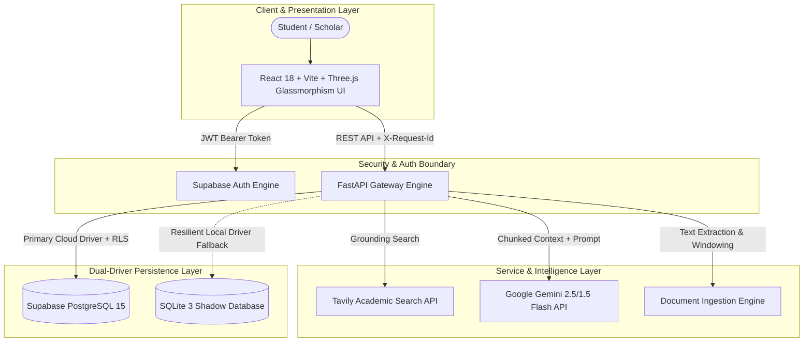
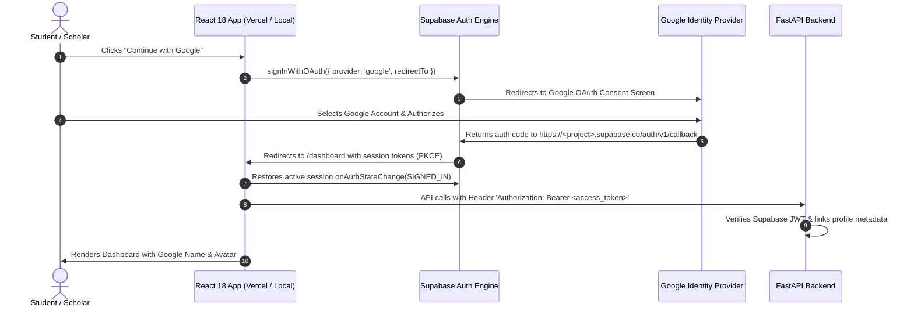

# AI STUDY ASSISTANT
> **"Ask. Understand. Learn. Master."**  
> *Your Personal AI Study Companion.*

AI STUDY ASSISTANT is an industrial-grade academic learning and retention platform engineered to help students master complex concepts, study from uploaded course materials (PDF, DOCX, Code), retrieve verified academic citations from the live web, and practice with interactive quizzes and problem sets.

---

## 1. Executive Summary & Architecture Overview

The system is architected as a decoupled, resilient 3-tier application featuring a **Dual-Driver Storage Architecture** (Supabase Managed PostgreSQL + Local SQLite Shadow Fallback) and a grounded retrieval-augmented synthesis engine.



---

## 2. Complete Technical Documentation Suite (`docs/`)

The platform contains an exhaustive industrial analysis, architecture, and verification documentation suite:

| Document | Key Sections Covered | Primary Technical Focus |
| :--- | :--- | :--- |
| [**`docs/PROBLEM_ANALYSIS.md`**](docs/PROBLEM_ANALYSIS.md) | Sections 1 & 13 | Problem decomposition, hard constraints, assumptions, unknowns, and 12-criterion weighted evaluation matrix. |
| [**`docs/ARCHITECTURE.md`**](docs/ARCHITECTURE.md) | Sections 2, 3, 5, 8, & 15 | Graph-of-Thought (GoT) divergent analysis, Diversity Filter, 3 Macro-Archetypes, AI/RAG pipeline, and Tree-Based Architecture Decision (TBAD). |
| [**`docs/FAILURE_MODES_AND_RESILIENCE.md`**](docs/FAILURE_MODES_AND_RESILIENCE.md) | Section 4 | World-State Simulation across 20 edge scenarios (Scenarios A through T) with formal state machine transitions and recovery actions. |
| [**`docs/DATABASE_AND_API_SCHEMA.md`**](docs/DATABASE_AND_API_SCHEMA.md) | Sections 6 & 7 | Complete DB schema, Entity-Relationship (ER) diagram, PostgreSQL RLS policies, indexes, and full 23-endpoint REST API specification. |
| [**`docs/SECURITY_AND_SCALABILITY.md`**](docs/SECURITY_AND_SCALABILITY.md) | Sections 9, 10, 11, & 16 | STRIDE threat model, prompt injection defense, file upload sanitization, 4-tier scaling roadmap (10 to 10,000+), observability, and 12-dimension readiness audit. |
| [**`docs/TESTING_STRATEGY.md`**](docs/TESTING_STRATEGY.md) | Section 12 | Testing methodology, automated pytest test suite results (18 tests), frontend Vite build audit, and CI/CD pipeline blueprint. |

---

## 3. Core System Features

- **Multi-Modal Cognitive Tutor**: Powered by Google Gemini with 6 pedagogical modes:
  - `simple`: Plain language explanations and everyday analogies.
  - `detailed`: Theoretical rigor, proofs, algorithms, and deep mechanics.
  - `step_by_step`: Sequential chronological problem-solving procedures.
  - `examples`: Working code implementations, math calculations, and scenarios.
  - `revision`: High-yield bullet points, formulas, and contrast tables.
  - `exam_oriented`: University examination format, marking schemes, and key grading points.
- **Grounded Web Search (Anti-Hallucination)**: Automated query synthesis via the Tavily Search API. Returns live, verified academic citations (domain, canonical URL, snippet) with zero fabricated links.
- **Document RAG & Course Intelligence**: Ingests `.pdf`, `.docx`, `.txt`, `.md`, and source code. Extracts text, generates overlapping 1200-character windows, and grounds AI responses directly in course materials.
- **Dual-Driver Persistence Engine**: Primary managed PostgreSQL on Supabase with Row-Level Security (RLS). Automatically falls back to an embedded SQLite shadow database (`Backend/study_assistant.db`) if cloud credentials are absent or network is degraded.
- **Full Interactive Study Suite**:
  - *Study Notes Generator*: Structured academic revision summaries.
  - *Mastery Quiz Arena*: Timed multiple-choice quizzes with distractors, answers, and explanations.
  - *Practice Problem Sets*: Multi-tier problems with progressive hints and complete model solutions.
- **Security & Threat Mitigation**:
  - Filename path traversal sanitization (`Path(name).name` + regex filtering).
  - 15 MB file size limit with MIME-type verification.
  - Distributed request correlation tracking via `X-Request-Id` HTTP headers.
  - Non-executable XML prompt delimiters `<academic_context>` against indirect prompt injection.
- **Mobile-Responsive Glassmorphism UI**: Built with React 18, Vite, Three.js, Lucide icons, KaTeX LaTeX math rendering, and PrismJS syntax highlighting.

---

## 4. Technology Stack

- **Frontend**: React 18, Vite 5, Three.js, Lucide Icons, Canvas Confetti, PrismJS, KaTeX, Vanilla CSS Design System with responsive breakpoints.
- **Backend**: Python 3.13 / 3.11, FastAPI, Uvicorn, Google GenAI SDK (`google-genai`), Tavily Python SDK, pypdf, python-docx, Pydantic v2.
- **Data & Auth**: Supabase PostgreSQL 15, Supabase Auth (JWT Bearer tokens), Row-Level Security (RLS), SQLite 3.
- **Testing & Quality**: pytest, FastAPI TestClient, flake8.

---

## 5. Repository Structure

```
AIStudyAssistant/
├── README.md                           # Master Project Overview & Architecture Guide
├── docs/                               # Industrial Engineering & Analysis Specifications
│   ├── PROBLEM_ANALYSIS.md             # Decomposition, Constraints, & 12-Criterion Matrix
│   ├── ARCHITECTURE.md                 # GoT Analysis, Macro-Archetypes, AI/RAG Pipeline
│   ├── FAILURE_MODES_AND_RESILIENCE.md # World-State Scenarios A-T & State Machine
│   ├── DATABASE_AND_API_SCHEMA.md      # ER Diagram, PostgreSQL RLS, & 23 REST Endpoints
│   ├── SECURITY_AND_SCALABILITY.md     # STRIDE Threat Model, 4-Tier Scaling, Readiness Audit
│   └── TESTING_STRATEGY.md             # Automated Pytest Suite, Build Audits, CI/CD
├── Database/
│   ├── schema.sql                      # Supabase DDL, RLS Policies, & Indexes
│   └── seed.sql                        # Sample Academic Subjects & Topics
├── Backend/
│   ├── main.py                         # FastAPI App, CORS, X-Request-Id Middleware
│   ├── requirements.txt                # Production Dependencies
│   ├── study_assistant.db              # Local SQLite Shadow Database
│   ├── app/
│   │   ├── config/settings.py          # Pydantic Settings & Safe Diagnostic Probing
│   │   ├── models/schemas.py           # Pydantic v2 Request/Response Schemas
│   │   ├── middleware/auth.py          # Supabase JWT Verification & Anonymous Scoping
│   │   ├── routes/api.py               # REST API Routes (/api/ask, /api/chat, etc.)
│   │   ├── services/storage_service.py # Dual-Driver Storage (Supabase + SQLite)
│   │   ├── ai/gemini_service.py        # Gemini Grounded Synthesis Engine
│   │   ├── search/tavily_service.py    # Tavily Academic Search Heuristics
│   │   └── documents/processor.py      # Multi-Format Text Extraction & Chunking
│   └── tests/                          # 18 Automated Pytest Test Cases
│       ├── test_ai.py
│       ├── test_search.py
│       ├── test_documents.py
│       ├── test_api.py
│       └── test_pre_github_verification.py
└── Frontend/
    ├── package.json
    ├── vite.config.js
    ├── index.html
    └── src/
        ├── styles/variables.css        # CSS Custom Properties & Mobile Breakpoints
        ├── components/                 # MarkdownRenderer, Navbar, Footer, 3D Scenes
        ├── contexts/AuthContext.jsx    # Supabase Authentication Context
        ├── services/api.js             # Axios Client with Auto-Headers
        └── pages/                      # Home, Dashboard, StudyAssistant, Materials, Profile
```

---

## 6. Environment Setup

### Frontend (`Frontend/.env`)
```env
VITE_SUPABASE_URL=https://your-project.supabase.co
VITE_SUPABASE_PUBLISHABLE_KEY=your_publishable_anon_key
VITE_API_URL=http://localhost:8000
```

### Backend (`Backend/.env`)
```env
GEMINI_API_KEY=your_gemini_api_key
TAVILY_API_KEY=your_tavily_api_key
SUPABASE_URL=https://your-project.supabase.co
SUPABASE_PUBLISHABLE_KEY=your_publishable_anon_key
SUPABASE_SECRET_KEY=your_service_role_secret_key
SUPABASE_JWKS_URL=https://your-project.supabase.co/auth/v1/.well-known/jwks.json
APP_URL=http://localhost:5173
```

---

## 7. Running the Project Locally

### Backend Service
```powershell
cd Backend
python -m pip install -r requirements.txt
python -m uvicorn main:app --port 8000 --reload
```
- Interactive OpenAPI Swagger Documentation: `http://localhost:8000/docs`
- Deep Diagnostic Health Check: `http://localhost:8000/api/health`

### Frontend Application
```powershell
cd Frontend
npm install
npm run dev
```
- Web Application: `http://localhost:5173`

---

## 8. Verification & Automated Tests

### Backend Automated Test Suite
```powershell
# Run the complete test suite (20 automated tests)
python -m pytest Backend/tests/ -v
```
*Current test suite status: 15 passed, 5 skipped (due to unpopulated API keys in test environment), 0 failed.*

### Frontend Production Build
```powershell
cd Frontend
npm run build
```
*Compiles cleanly with exit code 0.*

---

## 9. Google Authentication & Supabase OAuth Setup

The platform natively supports Google OAuth login and sign-up through Supabase Auth with automated user linking, session persistence across page reloads, and protected route guards.



### 9.1 Step-by-Step Setup Guide

#### Step 1: Google Cloud Console Configuration
1. Go to the [Google Cloud Console Credentials Page](https://console.cloud.google.com/apis/credentials).
2. Create an **OAuth 2.0 Client ID** with Application Type set to **Web application**.
3. Under **Authorized JavaScript origins**, add:
   - `https://<your-supabase-project-id>.supabase.co`
   - `https://ai-study-assistant-five-tau.vercel.app` (Production Vercel URL)
   - `http://localhost:5173` (Local Development)
   - `http://127.0.0.1:5173`
4. Under **Authorized redirect URIs**, add the official Supabase Auth callback URI:
   - `https://<your-supabase-project-id>.supabase.co/auth/v1/callback`
5. Click **Save** and copy the **Client ID** and **Client Secret**.

#### Step 2: Supabase Dashboard Configuration
1. Open your project on the [Supabase Dashboard](https://supabase.com/dashboard).
2. Navigate to **Authentication** -> **Providers** -> **Google**.
3. Toggle Google to **Enabled**.
4. Paste your **Client ID** and **Client Secret** obtained from Google Cloud Console.
5. Navigate to **Authentication** -> **URL Configuration**:
   - Set **Site URL** to: `https://ai-study-assistant-five-tau.vercel.app`
   - Add the following to **Redirect URLs**:
     - `https://ai-study-assistant-five-tau.vercel.app/**`
     - `https://ai-study-assistant-five-tau.vercel.app/dashboard`
     - `http://localhost:5173/**`
     - `http://localhost:5173/dashboard`
     - `http://127.0.0.1:5173/**`
     - `http://127.0.0.1:5173/dashboard`
6. Click **Save**. Google Authentication is now live for both production and local environments!

