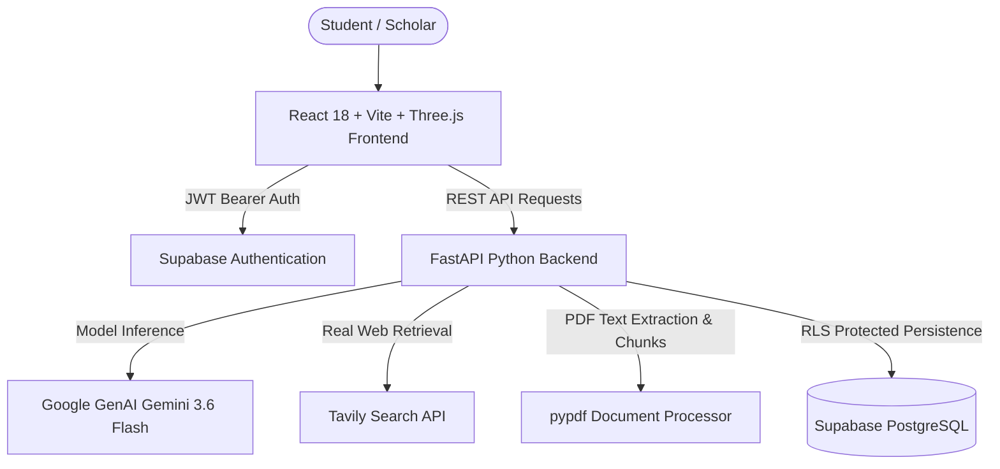

# AI STUDY ASSISTANT
> **"Ask. Understand. Learn. Master."**  
> *Your Personal AI Study Companion.*

AI STUDY ASSISTANT is a student-focused AI academic learning platform engineered to help students ask difficult questions, understand complex technical concepts in plain language, analyze uploaded course notes and PDF textbooks, search live educational documentation, and reinforce retention with interactive quizzes and practice problems.

---

## 1. Core Architecture



---

## 2. Features

- **3D Animated Hero & Visual Interface**: Three.js digital brain & knowledge core with interactive mouse cursor parallax, floating orbital nodes, and particle constellations.
- **Cognitive Question Answering**: Powered by `gemini-3.6-flash` supporting multiple academic modes:
  - *Simple*: Everyday language and analogies.
  - *Detailed*: Theoretical foundations, proofs, and architecture.
  - *Step-by-Step*: Sequential chronological breakdowns.
  - *Examples*: Working syntax and line-by-line worked problems.
  - *Revision*: High-yield bullet points and contrast tables.
  - *Exam-Oriented*: High-scoring examination format with marking schemes.
- **Zero Hallucination Web Search**: Tavily API integration strictly returns genuine, live citations (title, URL, domain, snippet). Never invents fake links.
- **Document & PDF Intelligence**: Upload course materials (`.pdf`, `.txt`, `.md`). Automatic extraction, overlapping chunking, and grounded Q&A.
- **Interactive Study Tools Suite**:
  - *Structured Study Notes Generator*: Publication-grade revision notes.
  - *Quiz Arena*: Instant multiple-choice tests with answer explanations and confetti.
  - *Practice Problem Sets*: Progressive hints and complete model solutions.
- **Dual-Driver Persistence**: Direct connection to Supabase PostgreSQL with Row-Level Security (RLS), with resilient fallback ensuring zero crashes or data loss.
- **Personalized Academic Hub**: Academic interest tags, college/course profile management, and saved bookmarks library.

---

## 3. Technology Stack

- **Frontend**: React 18, Vite 6, Three.js, Lucide Icons, Canvas Confetti, Vanilla CSS Glassmorphism.
- **Backend**: Python 3.13, FastAPI, Uvicorn, Google GenAI SDK, Tavily Python SDK, pypdf, Pydantic v2.
- **Database & Auth**: Supabase PostgreSQL, Supabase Auth (JWT), Row Level Security (RLS).

---

## 4. Folder Structure

```
AIStudyAssistant/
├── .gitignore
├── README.md
├── Database/
│   ├── README.md
│   ├── schema.sql
│   └── seed.sql
├── Backend/
│   ├── .env (Excluded from Git)
│   ├── .env.example
│   ├── requirements.txt
│   ├── main.py
│   ├── app/
│   │   ├── config/settings.py
│   │   ├── models/schemas.py
│   │   ├── services/
│   │   │   ├── supabase_client.py
│   │   │   └── storage_service.py
│   │   ├── ai/gemini_service.py
│   │   ├── search/tavily_service.py
│   │   ├── documents/processor.py
│   │   ├── middleware/auth.py
│   │   └── routes/api.py
│   └── tests/
│       ├── test_ai.py
│       ├── test_search.py
│       ├── test_documents.py
│       └── test_api.py
└── Frontend/
    ├── .env (Excluded from Git)
    ├── .env.example
    ├── package.json
    ├── vite.config.js
    ├── index.html
    └── src/
        ├── styles/
        │   ├── variables.css
        │   └── index.css
        ├── components/
        │   ├── Navbar.jsx
        │   ├── Footer.jsx
        │   ├── SourceBadge.jsx
        │   └── 3d/
        │       ├── Hero3DScene.jsx
        │       ├── StudyCard3D.jsx
        │       ├── TopicCloud3D.jsx
        │       ├── HowItWorks3D.jsx
        │       └── Loading3D.jsx
        ├── contexts/AuthContext.jsx
        ├── services/
        │   ├── supabase.js
        │   └── api.js
        ├── pages/
        │   ├── Home.jsx
        │   ├── Login.jsx
        │   ├── Register.jsx
        │   ├── Dashboard.jsx
        │   ├── StudyAssistant.jsx
        │   ├── ConversationsList.jsx
        │   ├── ConversationView.jsx
        │   ├── StudyMaterials.jsx
        │   ├── DocumentDetail.jsx
        │   ├── LearningResources.jsx
        │   ├── SavedResources.jsx
        │   └── Profile.jsx
        ├── App.jsx
        └── main.jsx
```

---

## 5. Environment Configuration

### Frontend (`Frontend/.env`)
```env
VITE_SUPABASE_URL=https://your-project.supabase.co
VITE_SUPABASE_PUBLISHABLE_KEY=your_publishable_anon_key
VITE_API_URL=http://localhost:8000
```

### Backend (`Backend/.env`)
```env
GEMINI_API_KEY=your_gemini_api_key
TAVILY_API_KEY=your_tavily_api_key
SUPABASE_URL=https://your-project.supabase.co
SUPABASE_PUBLISHABLE_KEY=your_publishable_anon_key
SUPABASE_SECRET_KEY=your_service_role_secret_key
SUPABASE_JWKS_URL=https://your-project.supabase.co/auth/v1/.well-known/jwks.json
APP_URL=http://localhost:5173
```

> [!CAUTION]
> Never place `GEMINI_API_KEY`, `TAVILY_API_KEY`, or `SUPABASE_SECRET_KEY` in frontend source code, browser storage, or git commits.

---

## 6. Supabase Database Setup

1. Open your [Supabase Dashboard](https://supabase.com/dashboard).
2. Go to your project -> **SQL Editor** -> **New Query**.
3. Paste the contents of `Database/schema.sql` and run it.
4. All tables (`profiles`, `conversations`, `messages`, `uploaded_documents`, `document_chunks`, `saved_resources`, `user_interests`), RLS policies, and triggers are created instantly.

---

## 7. Running Locally

### Backend
```powershell
cd Backend
python -m pip install -r requirements.txt
python -m uvicorn main:app --port 8000 --reload
```
API Documentation will be live at `http://localhost:8000/docs`.

### Frontend
```powershell
cd Frontend
npm install
npm run dev
```
Open `http://localhost:5173` in your browser.

---

## 8. Automated Tests

Run backend tests:
```powershell
cd Backend
python -m pytest tests -v
```
All 8 automated tests verify AI prompt generation, Tavily search filters, document validation/chunking, and REST endpoints.
