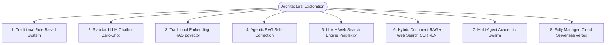
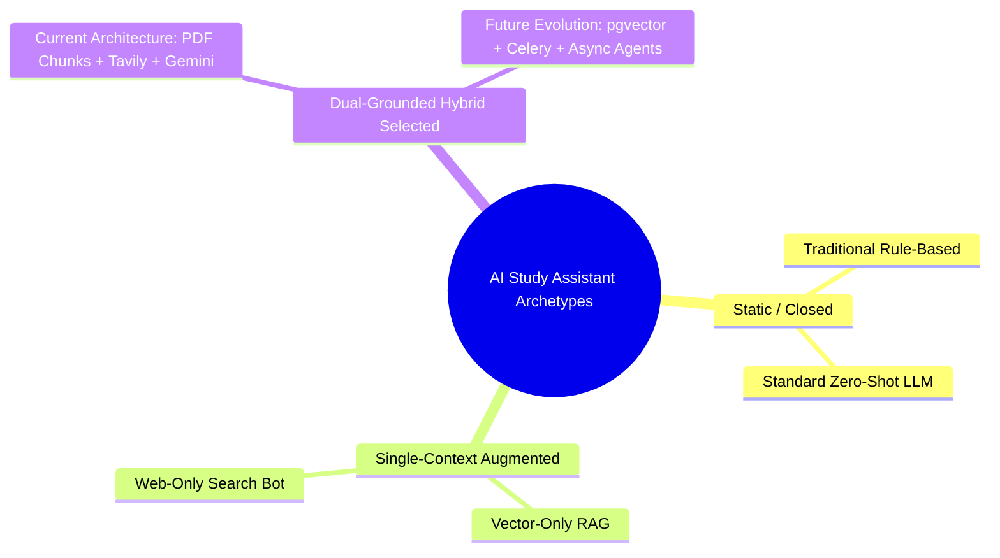
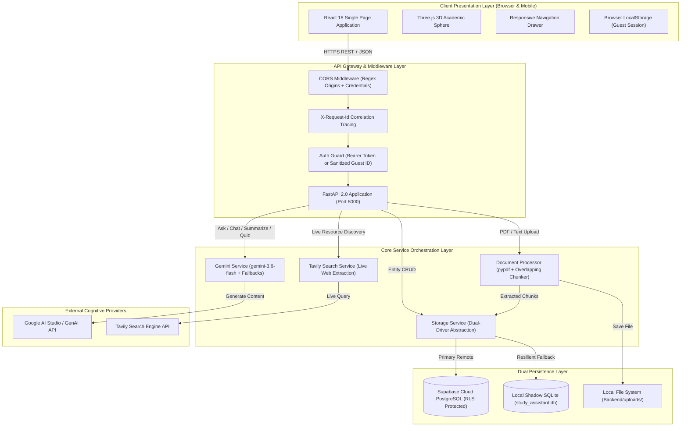
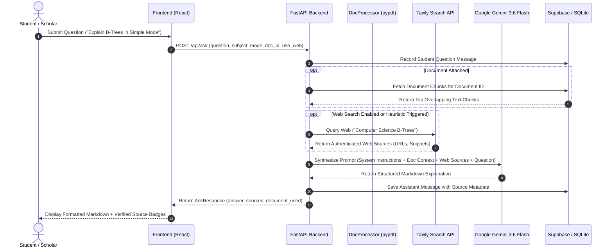
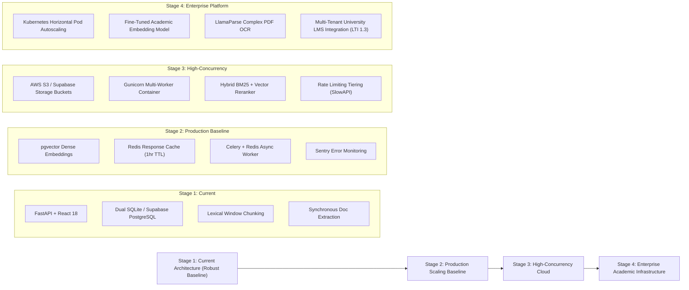

# System Architecture & Divergent Solution Analysis

## 1. Divergent Solution Analysis (Graph of Thoughts)

To establish an industrial-grade architectural baseline, 8 fundamentally different possible design paradigms for an AI Academic Assistant were evaluated across 8 engineering dimensions.

### Comparative Evaluation Matrix

| Family | Architecture Core | Strengths | Weaknesses | Complexity | Scalability | Cost | Project Suitability |
| :--- | :--- | :--- | :--- | :--- | :--- | :--- | :--- |
| **A. Rule-Based Bot** | Hardcoded decision trees & regex matching | 100% deterministic, zero API cost | Cannot answer novel questions; impossible to maintain | Low | High | Very Low | **Unsuitable** (Cannot synthesize academic topics) |
| **B. Standard LLM Chatbot** | Single prompt to Gemini/GPT-4 without context | Fast, simple implementation | Severe hallucinations; out-of-date information; no syllabus grounding | Low | High | Low | **Inadequate** (High hallucination risk in STEM) |
| **C. Traditional Vector RAG** | Document chunking $\rightarrow$ embeddings $\rightarrow$ vector index (HNSW/IVF) | Excellent retrieval on uploaded textbooks | Blind to external web knowledge; requires embedding infra & vector DB | Moderate | High | Moderate | **Partially Suitable** (Lacks web grounding) |
| **D. Agentic RAG** | ReAct loop: plan $\rightarrow$ search $\rightarrow$ grade chunk $\rightarrow$ rewrite query | High retrieval precision; self-correcting | High latency (5s–15s); recursive API cost; loop instability | High | Moderate | High | **Future Milestone** (Too slow for instant mobile study) |
| **E. LLM + Web Search** | Query rewrite $\rightarrow$ Tavily/Bing $\rightarrow$ synthesis with live links | Up-to-date documentation; verified URLs | Cannot answer from student's proprietary lecture notes or PDFs | Moderate | High | Moderate | **Incomplete** (Ignored course PDF materials) |
| **F. Adaptive RAG + Hybrid Search (*Current*)** | Adaptive intent router + Dual-track Hybrid Retrieval (Dense Vector + Keyword FTS) + RRF + Reranking + Tavily live web | Grounded on student notes with pinpoint citations AND verified live web; dual persistence resilience | Requires embedding calculation during upload | Moderate | High | Moderate | **Optimal Sweet Spot** (Solves all academic needs) |
| **G. Multi-Agent Swarm** | Autonomous agents (Researcher, Critic, Examiner, Formatter) | Distributed specialization | Excessive latency (10s–30s); token explosion; debugging nightmare | Very High | Low | Very High | **Unsuitable for MVP/Base** (Over-engineered) |
| **H. Cloud-Native Managed** | AWS Bedrock / Google Vertex AI Agents | Fully managed scaling; enterprise SLA | Vendor lock-in; inflexible local development; high operational floor cost | Moderate | Very High | High | **Future Enterprise Milestone** |

---

## 2. Diversity Filter & Architectural Decision

### Solution Family Clustering

To avoid redundant alternatives, the 8 approaches are grouped into 3 distinct macro-archetypes:

1. **Filtered Out (Static / Closed Archetype)**:
   - *Traditional Rule-Based* and *Standard Zero-Shot LLMs* were rejected because academic mastery demands dynamic comprehension combined with verified external citations.
2. **Filtered Out as Incomplete (Single-Context Archetype)**:
   - *Vector-Only RAG* fails when students ask about recent technological versions (e.g. Next.js 15, Python 3.13) absent from their lecture slides.
   - *Web-Only Search* fails when students ask about course-specific exam formulas or professor-defined notation.
3. **Selected Architectural Decision (Dual-Grounded Hybrid Archetype)**:
   - Adopts **Family F (Hybrid RAG + Web Search)**: Ingests uploaded student notes for grounded course-specific answers, queries Tavily for live verified external documentation, and synthesizes through Google Gemini using multi-modal pedagogical frameworks.

---

## 3. System Architecture & Complete Component Schema

### High-Level Component Interaction Diagram

### Component Responsibility Breakdown

| Layer | Component | Core Responsibilities |
| :--- | :--- | :--- |
| **Frontend** | `React 18 + Vite` | Fluid multi-device rendering, glassmorphic UI, Markdown syntax formatting, state management, client guest ID creation. |
| **Frontend** | `Three.js Scene` | Interactive 3D Digital Brain visualization, mouse parallax, touch pan-y scrolling bypass. |
| **Backend API** | `FastAPI Router` | 23 REST endpoints, payload Pydantic validation, status code mapping, correlation ID injection. |
| **Auth** | `JWT / Guest Middleware` | Supabase access token verification, guest token cryptographic sanitization (`[^a-zA-Z0-9_-]`). |
| **AI Cognition** | `GeminiService` | Prompt templating across 6 academic modes, system instructions, temperature control, fallback to 1.5-flash. |
| **Search Engine** | `TavilyService` | Academic heuristics triggering, real-world snippet and URL extraction, domain parsing. |
| **Documents** | `DocumentProcessor` | Extension whitelist, 25MB boundary check, selectable text extraction (`pypdf`), 1000/150 char chunking. |
| **Persistence** | `StorageService` | Dual-driver abstraction: routes to Supabase PostgreSQL when credentials exist, fails over to local SQLite. |

---

## 4. AI & Retrieval Pipeline (Implementation Grounding)

### Precise Implementation Clarifications (No False Claims)
- **Document Retrieval Mechanism (Adaptive RAG)**:
  - The document ingestion pipeline extracts structured text from PDFs, TXT, MD, and DOCX files.
  - Generates 768-dimensional dense vector embeddings via Google's `text-embedding-004` model (with unit-norm deterministic fallback).
  - Stores chunks with vector embeddings in `document_chunks` table (Supabase `pgvector` with HNSW index / SQLite fallback).
  - Implements **Dual-Track Hybrid Retrieval**: Runs dense semantic cosine similarity search alongside sparse keyword / full-text search.
  - Combines ranked results using **Reciprocal Rank Fusion (RRF, $k=60$)**.
  - Reranks top candidates via **Contextual Reranking** evaluating term density, exact phrase matching, and section heading alignment.
  - Formulates structured citations with page numbers and section titles before injecting top-K passages into Gemini.
- **Web Search Mechanism**:
  - Uses the official Tavily SDK to perform semantic search queries when the Adaptive Router detects temporal, live, or external query requirements.
  - Returned sources contain verified domains, live URLs, and real snippet summaries. Zero fabricated citations.
- **Cognitive Model Fallback**:
  - Primary model: `gemini-3.5-flash-lite` / `gemini-3.6-flash`.
  - Fallback sequence: Automatically cascades to `gemini-flash-lite-latest`, `gemini-3-flash-preview`, `gemini-3.8-flash` if rate-limited or unavailable.

---

## 5. Tree-Based Architecture Evolution Roadmap

