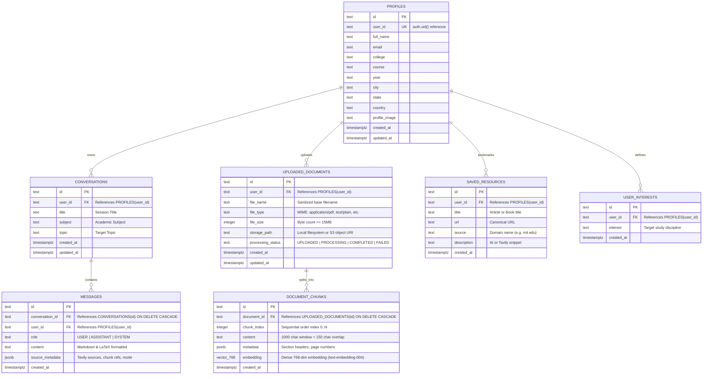

# Database Schema, Relationships, RLS Policies, and API Specification

This document provides the exhaustive technical reference for the data layer and API interface of the **AI Study Assistant** platform. It satisfies Sections 6 and 7 of the Industrial/Commercial Architecture & Analysis specification.

---

## 1. Database Schema & Dual-Driver Storage Architecture

AI Study Assistant implements an **Industrial Dual-Driver Storage Pattern**:
1. **Primary Cloud Driver**: Supabase (PostgreSQL 15+) when cloud credentials (`SUPABASE_URL`, `SUPABASE_SERVICE_ROLE_KEY`) are active.
2. **Resilient Local Driver**: Embedded SQLite 3 (`Backend/study_assistant.db`) providing automated zero-configuration fallback when cloud services are unreachable or running in localized offline/edge environments.

### 1.1 Entity-Relationship (ER) Diagram



---

### 1.2 Table Definitions, Constraints, and Types

#### Table: `profiles`
Stores student academic demographics, institution affiliation, and personalized preferences.
- `id` (TEXT / UUID, PRIMARY KEY): Unique identifier.
- `user_id` (TEXT / UUID, UNIQUE, NOT NULL): Foreign identity mapping to authentication provider (`auth.users.id`).
- `full_name` (TEXT, NULLABLE): Student's display name.
- `email` (TEXT, NULLABLE): Contact email.
- `college` (TEXT, NULLABLE): Enrolled university, institute, or school.
- `course` (TEXT, NULLABLE): Major or degree program (e.g., "B.Tech Computer Science").
- `year` (TEXT, NULLABLE): Academic progression (e.g., "3rd Year").
- `city` (TEXT, NULLABLE): Geographic locality.
- `state` (TEXT, NULLABLE): State / Province.
- `country` (TEXT, NULLABLE): Country.
- `profile_image` (TEXT, NULLABLE): URL to avatar image.
- `created_at` (TIMESTAMPTZ, DEFAULT NOW()): Profile creation timestamp.
- `updated_at` (TIMESTAMPTZ, DEFAULT NOW()): Last modification timestamp.

#### Table: `conversations`
Tracks multi-turn study sessions grouped by subject and topic.
- `id` (TEXT / UUID, PRIMARY KEY): Conversation UUID.
- `user_id` (TEXT, NOT NULL): Owner identity.
- `title` (TEXT, NOT NULL): Dynamic title extracted from initial student query.
- `subject` (TEXT, DEFAULT 'General'): Academic discipline (e.g., 'Computer Science', 'Mathematics').
- `topic` (TEXT, NULLABLE): Specific topic (e.g., 'Dynamic Programming').
- `created_at` (TIMESTAMPTZ, DEFAULT NOW()): Creation timestamp.
- `updated_at` (TIMESTAMPTZ, DEFAULT NOW()): Last activity timestamp.

#### Table: `messages`
Stores individual conversational turns (prompts and AI explanations).
- `id` (TEXT / UUID, PRIMARY KEY): Message UUID.
- `conversation_id` (TEXT, NOT NULL): Foreign key referencing `conversations(id)` with `ON DELETE CASCADE`.
- `user_id` (TEXT, NOT NULL): Owner identity.
- `role` (TEXT, NOT NULL): Turn type: `USER`, `ASSISTANT`, or `SYSTEM`.
- `content` (TEXT, NOT NULL): Raw text payload (rendered with Markdown and KaTeX math).
- `source_metadata` (TEXT / JSONB, NULLABLE): Web search citations, document chunk references, explanation mode.
- `created_at` (TIMESTAMPTZ, DEFAULT NOW()): Timestamp of message transmission.

#### Table: `uploaded_documents`
Catalog of student-uploaded course materials (PDF, DOCX, TXT, MD, Code).
- `id` (TEXT / UUID, PRIMARY KEY): Document UUID.
- `user_id` (TEXT, NOT NULL): Owner identity.
- `file_name` (TEXT, NOT NULL): Original filename (sanitized to prevent directory traversal).
- `file_type` (TEXT, NOT NULL): MIME type (e.g., `application/pdf`).
- `file_size` (INTEGER, NOT NULL): Size in bytes (enforced maximum 15 MB).
- `storage_path` (TEXT, NOT NULL): Local disk path or remote blob key.
- `processing_status` (TEXT, DEFAULT 'UPLOADED'): State: `UPLOADED`, `PROCESSING`, `COMPLETED`, `FAILED`.
- `created_at` (TIMESTAMPTZ, DEFAULT NOW()): Upload timestamp.
- `updated_at` (TIMESTAMPTZ, DEFAULT NOW()): Status change timestamp.

#### Table: `document_chunks`
Extracted, sanitized text chunks partitioned for lexical context injection into LLM prompts.
- `id` (TEXT / UUID, PRIMARY KEY): Chunk UUID.
- `document_id` (TEXT, NOT NULL): Foreign key referencing `uploaded_documents(id)` with `ON DELETE CASCADE`.
- `chunk_index` (INTEGER, NOT NULL): Ordered integer position (0, 1, 2, ...).
- `content` (TEXT, NOT NULL): Windowed text slice (default 1000 characters, 150 character overlap).
- `metadata` (TEXT / JSONB, NULLABLE): Heading tags, page numbers, character offsets.
- `embedding` (VECTOR(768), NULLABLE): Dense vector embedding generated by Google's `text-embedding-004`.
- `created_at` (TIMESTAMPTZ, DEFAULT NOW()): Processing timestamp.

#### Table: `saved_resources`
Bookmarked academic citations, research links, and web learning resources.
- `id` (TEXT / UUID, PRIMARY KEY): Bookmark UUID.
- `user_id` (TEXT, NOT NULL): Owner identity.
- `title` (TEXT, NOT NULL): Resource heading.
- `url` (TEXT, NOT NULL): Verified HTTPS URL.
- `source` (TEXT, NOT NULL): Origin domain or publisher.
- `description` (TEXT, NULLABLE): Summarized abstract or snippet.
- `created_at` (TIMESTAMPTZ, DEFAULT NOW()): Bookmark timestamp.

#### Table: `user_interests`
Individual academic topic tags linked to the student profile for tailored curriculum suggestions.
- `id` (TEXT / UUID, PRIMARY KEY): Interest UUID.
- `user_id` (TEXT, NOT NULL): Owner identity.
- `interest` (TEXT, NOT NULL): Cleaned tag string (e.g., "Machine Learning").
- `created_at` (TIMESTAMPTZ, DEFAULT NOW()): Creation timestamp.
- **Constraint**: `UNIQUE(user_id, interest)` prevents duplicate tags per student.

---

### 1.3 Recommended PostgreSQL Indexes

To ensure sub-50ms query performance under concurrent multi-tenant loads:
```sql
-- Conversations lookups by user and recency
CREATE INDEX IF NOT EXISTS idx_conversations_user_updated 
ON conversations (user_id, updated_at DESC);

-- Messages retrieval by conversation
CREATE INDEX IF NOT EXISTS idx_messages_conv_created 
ON messages (conversation_id, created_at ASC);

-- Document chunks retrieval by document and sequence
CREATE INDEX IF NOT EXISTS idx_doc_chunks_doc_seq 
ON document_chunks (document_id, chunk_index ASC);

-- HNSW Vector Index for Cosine Distance Search
CREATE INDEX IF NOT EXISTS idx_doc_chunks_embedding
ON document_chunks USING hnsw (embedding vector_cosine_ops);

-- Full-Text Search (GIN) Index for Lexical Keyword Matching
CREATE INDEX IF NOT EXISTS idx_doc_chunks_fts
ON document_chunks USING gin (to_tsvector('english', content));

-- Documents list by user
CREATE INDEX IF NOT EXISTS idx_documents_user_created 
ON uploaded_documents (user_id, created_at DESC);

-- Saved resources by user
CREATE INDEX IF NOT EXISTS idx_resources_user_created 
ON saved_resources (user_id, created_at DESC);

-- User interests lookup
CREATE INDEX IF NOT EXISTS idx_interests_user 
ON user_interests (user_id);
```

---

### 1.4 Supabase Row-Level Security (RLS) Policies

When deployed with PostgreSQL/Supabase, multi-tenant isolation is cryptographically guaranteed at the database engine level via Row-Level Security:

```sql
-- 1. Enable RLS on all operational tables
ALTER TABLE profiles ENABLE ROW LEVEL SECURITY;
ALTER TABLE conversations ENABLE ROW LEVEL SECURITY;
ALTER TABLE messages ENABLE ROW LEVEL SECURITY;
ALTER TABLE uploaded_documents ENABLE ROW LEVEL SECURITY;
ALTER TABLE document_chunks ENABLE ROW LEVEL SECURITY;
ALTER TABLE saved_resources ENABLE ROW LEVEL SECURITY;
ALTER TABLE user_interests ENABLE ROW LEVEL SECURITY;

-- 2. Profiles: Users can view and modify only their own record
CREATE POLICY "Users can view own profile" 
ON profiles FOR SELECT USING (auth.uid() = user_id::uuid);

CREATE POLICY "Users can insert own profile" 
ON profiles FOR INSERT WITH CHECK (auth.uid() = user_id::uuid);

CREATE POLICY "Users can update own profile" 
ON profiles FOR UPDATE USING (auth.uid() = user_id::uuid);

-- 3. Conversations: Strict tenant ownership
CREATE POLICY "Users can view own conversations" 
ON conversations FOR SELECT USING (auth.uid() = user_id::uuid);

CREATE POLICY "Users can insert own conversations" 
ON conversations FOR INSERT WITH CHECK (auth.uid() = user_id::uuid);

CREATE POLICY "Users can update own conversations" 
ON conversations FOR UPDATE USING (auth.uid() = user_id::uuid);

CREATE POLICY "Users can delete own conversations" 
ON conversations FOR DELETE USING (auth.uid() = user_id::uuid);

-- 4. Messages: Owned directly or through conversation ownership
CREATE POLICY "Users can view own messages" 
ON messages FOR SELECT USING (auth.uid() = user_id::uuid);

CREATE POLICY "Users can insert own messages" 
ON messages FOR INSERT WITH CHECK (auth.uid() = user_id::uuid);

CREATE POLICY "Users can delete own messages" 
ON messages FOR DELETE USING (auth.uid() = user_id::uuid);

-- 5. Documents & Chunks
CREATE POLICY "Users can view own uploaded documents" 
ON uploaded_documents FOR SELECT USING (auth.uid() = user_id::uuid);

CREATE POLICY "Users can insert own uploaded documents" 
ON uploaded_documents FOR INSERT WITH CHECK (auth.uid() = user_id::uuid);

CREATE POLICY "Users can delete own uploaded documents" 
ON uploaded_documents FOR DELETE USING (auth.uid() = user_id::uuid);

CREATE POLICY "Users can view chunks of own documents" 
ON document_chunks FOR SELECT USING (
    EXISTS (
        SELECT 1 FROM uploaded_documents 
        WHERE uploaded_documents.id = document_chunks.document_id 
        AND uploaded_documents.user_id::uuid = auth.uid()
    )
);

CREATE POLICY "Users can delete chunks of own documents" 
ON document_chunks FOR DELETE USING (
    EXISTS (
        SELECT 1 FROM uploaded_documents 
        WHERE uploaded_documents.id = document_chunks.document_id 
        AND uploaded_documents.user_id::uuid = auth.uid()
    )
);

-- 6. Saved Resources
CREATE POLICY "Users can manage own bookmarks" 
ON saved_resources FOR ALL USING (auth.uid() = user_id::uuid);

-- 7. User Interests
CREATE POLICY "Users can manage own interests" 
ON user_interests FOR ALL USING (auth.uid() = user_id::uuid);
```

---

### 1.5 Google Identity Federation & User Provisioning

When a student authenticates via "Continue with Google":
1. **Supabase Auth Engine Provisioning**:
   - Google identity tokens are exchanged via Supabase's callback handler (`/auth/v1/callback`).
   - A unique account is automatically provisioned in `auth.users` with `id` (UUID), `email`, and `user_metadata` (containing `full_name`, `name`, `avatar_url`, and `picture`).
   - The user ID is cryptographically mapped to `auth.uid()`, satisfying all PostgreSQL Row-Level Security (RLS) policies.
2. **First-Login Profile Instantiation**:
   - When the student first lands on the platform, `GET /api/profile` receives the verified Supabase JWT Bearer token.
   - `StorageService.get_or_create_profile` extracts `full_name` and `profile_image` from user metadata and persists the initial profile in `profiles` (with fallback to the local SQLite shadow database).
3. **Session Lifecycles & Token Refresh**:
   - The client uses PKCE (`flowType: 'pkce'`) with automatic token refresh (`autoRefreshToken: true`), ensuring the user remains authenticated across browser reloads without prompting for credentials.

---

## 2. Exhaustive API Specification

The API is built on FastAPI and mounted under the `/api` prefix (with operational root diagnostics at `/`). All responses are serialized to JSON with strict Pydantic schemas. Every endpoint propagates an `X-Request-Id` correlation header.

### 2.1 System Root & Diagnostics

#### `GET /`
- **Purpose**: System health ping, root service metadata, API documentation links.
- **Authentication**: Public (None).
- **Request Parameters / Body**: None.
- **Success Response (200 OK)**:
  ```json
  {
    "platform": "AI STUDY ASSISTANT",
    "tagline": "Ask. Understand. Learn. Master.",
    "supporting": "Your Personal AI Study Companion.",
    "status": "online",
    "api_docs": "/docs",
    "health": "/api/health"
  }
  ```
- **Error Responses**: None.

#### `GET /favicon.ico`
- **Purpose**: Prevents browser 404 log noise.
- **Authentication**: Public.
- **Response**: 204 No Content.

#### `GET /api/health`
- **Purpose**: Deep component diagnostics verifying API keys, database driver status, upload folder permissions, and runtime metadata.
- **Authentication**: Public.
- **Request Parameters / Body**: None.
- **Success Response (200 OK)**:
  ```json
  {
    "status": "healthy",
    "app_name": "AI STUDY ASSISTANT",
    "version": "2.0.0",
    "services": {
      "gemini_api": true,
      "tavily_api": true,
      "supabase": false,
      "upload_directory": true,
      "environment": "production"
    },
    "timestamp": "2026-09-17T13:08:45.123456Z"
  }
  ```
- **Error Responses**: 500 Internal Server Error (if core initialization fails).

---

### 2.2 AI Study Core: Ask & Chat

#### `POST /api/ask`
- **Purpose**: Primary academic question engine. Coordinates Tavily live academic search, document retrieval, and Gemini prompt synthesis.
- **Authentication**: Optional (Extracts Bearer JWT if provided; falls back to deterministic anonymous session identity).
- **Request Body (`application/json`)**:
  ```json
  {
    "question": "Explain Dijkstra's Algorithm with time complexity and an example",
    "subject": "Computer Science",
    "topic": "Graph Algorithms",
    "custom_topic": null,
    "explanation_mode": "detailed",
    "use_web_search": true,
    "document_id": null,
    "conversation_id": null
  }
  ```
  - `question` (str, min_length=2, REQUIRED): Academic question.
  - `subject` (str, optional, default "Computer Science"): Academic category.
  - `topic` / `custom_topic` (str, optional): Target topic name.
  - `explanation_mode` (str, default "simple"): One of `simple`, `detailed`, `step_by_step`, `revision`, `exam_oriented`, `examples`.
  - `use_web_search` (bool, optional): Force or suppress web search; auto-detects if null.
  - `document_id` (str, optional): Attached document UUID for context grounding.
  - `conversation_id` (str, optional): Target conversation UUID; creates a new conversation if null.
- **Success Response (200 OK)**:
  ```json
  {
    "answer": "# Dijkstra's Algorithm\n\nDijkstra's Algorithm finds the shortest path...",
    "subject": "Computer Science",
    "topic": "Graph Algorithms",
    "explanation_mode": "detailed",
    "sources": [
      {
        "title": "Dijkstra's Shortest Path - GeeksforGeeks",
        "url": "https://www.geeksforgeeks.org/dijkstras-shortest-path-algorithm-greedy-algo-7/",
        "domain": "geeksforgeeks.org",
        "description": "Comprehensive explanation of Dijkstra's algorithm using priority queues.",
        "is_live": true
      }
    ],
    "web_search_used": true,
    "document_used": false,
    "conversation_id": "f47ac10b-58cc-4372-a567-0e02b2c3d479",
    "message_id": "a1b2c3d4-e5f6-7890-abcd-1234567890ef",
    "warning": null
  }
  ```
- **Error Responses**:
  - `422 Unprocessable Entity`: Question shorter than 2 characters or malformed JSON.
  - `500 Internal Server Error`: Uncaught processing error with correlation ID.

#### `POST /api/chat`
- **Purpose**: Continues an existing multi-turn conversation, retaining full previous message context.
- **Authentication**: Optional / Authenticated.
- **Request Body (`application/json`)**:
  ```json
  {
    "conversation_id": "f47ac10b-58cc-4372-a567-0e02b2c3d479",
    "message": "Can this algorithm handle negative edge weights?",
    "subject": "Computer Science",
    "topic": "Graph Algorithms",
    "custom_topic": null,
    "explanation_mode": "step_by_step",
    "use_web_search": null,
    "document_id": null
  }
  ```
- **Success Response (200 OK)**: `AskResponse` schema (identical to `/api/ask`).
- **Error Responses**:
  - `404 Not Found`: Conversation ID does not exist or does not belong to user.
  - `422 Unprocessable Entity`: Missing conversation ID or message.

---

### 2.3 Conversation Management

#### `GET /api/conversations`
- **Purpose**: Lists all conversations for the current student, ordered by most recent update.
- **Authentication**: Optional / Authenticated.
- **Success Response (200 OK)**:
  ```json
  [
    {
      "id": "f47ac10b-58cc-4372-a567-0e02b2c3d479",
      "user_id": "usr-123",
      "title": "Explain Dijkstra's Algorithm...",
      "subject": "Computer Science",
      "topic": "Graph Algorithms",
      "created_at": "2026-09-17T12:00:00Z",
      "updated_at": "2026-09-17T12:05:00Z",
      "messages": null
    }
  ]
  ```

#### `POST /api/conversations`
- **Purpose**: Creates an empty study conversation session.
- **Authentication**: Optional / Authenticated.
- **Request Body**:
  ```json
  {
    "title": "Operating Systems Midterm Prep",
    "subject": "Computer Science",
    "topic": "Virtual Memory"
  }
  ```
- **Success Response (200 OK)**: `ConversationResponse` with `messages: []`.

#### `GET /api/conversations/{conversation_id}`
- **Purpose**: Retrieves a specific conversation with all historical messages and metadata.
- **Authentication**: Optional / Authenticated.
- **Path Parameter**: `conversation_id` (str).
- **Success Response (200 OK)**:
  ```json
  {
    "id": "f47ac10b-58cc-4372-a567-0e02b2c3d479",
    "user_id": "usr-123",
    "title": "Operating Systems Midterm Prep",
    "subject": "Computer Science",
    "topic": "Virtual Memory",
    "created_at": "2026-09-17T12:00:00Z",
    "updated_at": "2026-09-17T12:05:00Z",
    "messages": [
      {
        "id": "msg-1",
        "role": "USER",
        "content": "What is thrashing?",
        "source_metadata": null,
        "created_at": "2026-09-17T12:01:00Z"
      },
      {
        "id": "msg-2",
        "role": "ASSISTANT",
        "content": "Thrashing occurs when...",
        "source_metadata": {"sources": [], "web_search_used": false},
        "created_at": "2026-09-17T12:01:05Z"
      }
    ]
  }
  ```
- **Error Responses**: `404 Not Found`.

#### `PATCH /api/conversations/{conversation_id}`
- **Purpose**: Updates conversation title, subject, or topic.
- **Authentication**: Optional / Authenticated.
- **Request Body**:
  ```json
  {
    "title": "Updated Session Title",
    "subject": "Mathematics",
    "topic": "Linear Algebra"
  }
  ```
- **Success Response (200 OK)**: Updated `ConversationResponse`.
- **Error Responses**: `404 Not Found`.

#### `DELETE /api/conversations/{conversation_id}`
- **Purpose**: Deletes conversation and cascades delete to all associated messages.
- **Authentication**: Optional / Authenticated.
- **Success Response (200 OK)**:
  ```json
  {
    "status": "success",
    "message": "Conversation deleted."
  }
  ```

---

### 2.4 Document Management & Ingestion

#### `POST /api/documents/upload`
- **Purpose**: Uploads and processes an academic document (PDF, DOCX, TXT, MD, Code). Extracts text, creates 1200-char overlapping chunks, and stores them for context retrieval.
- **Authentication**: Optional / Authenticated.
- **Request**: Multipart Form-Data with field `file: UploadFile`.
- **Validation**:
  - Allowed extensions: `.pdf`, `.docx`, `.txt`, `.md`, `.py`, `.java`, `.cpp`, `.c`, `.js`, `.ts`, `.html`, `.css`.
  - Maximum size: 15 MB (15,728,640 bytes).
  - Filename sanitized against path traversal (`..`, special characters).
- **Success Response (200 OK)**:
  ```json
  {
    "id": "doc-uuid-1234",
    "user_id": "usr-123",
    "file_name": "Operating_Systems_Notes.pdf",
    "file_type": "application/pdf",
    "file_size": 2457600,
    "storage_path": "uploads/20260917120000_Operating_Systems_Notes.pdf",
    "processing_status": "COMPLETED",
    "created_at": "2026-09-17T12:00:00Z",
    "chunks_count": 34,
    "preview_chunks": [
      {
        "id": "chk-1",
        "chunk_index": 0,
        "content": "Chapter 1: Operating System Principles...",
        "metadata": {"section": "1.1"}
      }
    ]
  }
  ```
- **Error Responses**:
  - `400 Bad Request`: File exceeds 15MB or unsupported file extension.
  - `500 Internal Server Error`: Parser extraction failure.

#### `GET /api/documents`
- **Purpose**: Lists all documents uploaded by the current student.
- **Authentication**: Optional / Authenticated.
- **Success Response (200 OK)**: List of `DocumentResponse` objects.

#### `GET /api/documents/{document_id}`
- **Purpose**: Retrieves document metadata and preview chunks.
- **Authentication**: Optional / Authenticated.
- **Success Response (200 OK)**: `DocumentResponse`.
- **Error Responses**: `404 Not Found`.

#### `DELETE /api/documents/{document_id}`
- **Purpose**: Removes document record, removes local file from disk, and cascades delete to chunks.
- **Authentication**: Optional / Authenticated.
- **Success Response (200 OK)**: `{"status": "success", "message": "Document deleted."}`.

#### `POST /api/documents/{document_id}/ask`
- **Purpose**: Targeted Q&A grounded specifically in the content of the selected document.
- **Authentication**: Optional / Authenticated.
- **Request Body**:
  ```json
  {
    "question": "What are the four necessary conditions for deadlock listed in this PDF?",
    "explanation_mode": "exam_oriented"
  }
  ```
- **Success Response (200 OK)**: `AskResponse` with `document_used: true` and `sources: []`.
- **Error Responses**:
  - `400 Bad Request`: Document contains no extractable text chunks.
  - `404 Not Found`: Document ID not found.

---

### 2.5 Academic Study Tools

#### `POST /api/study/summarize`
- **Purpose**: Synthesizes high-yield academic summaries from raw text or uploaded documents.
- **Authentication**: Optional / Authenticated.
- **Request Body**:
  ```json
  {
    "text": "Detailed lecture notes text...",
    "document_id": null,
    "topic": "Thermodynamics Laws",
    "subject": "Physics"
  }
  ```
- **Success Response (200 OK)**:
  ```json
  {
    "summary": "### Key Summary Points\n- First Law: Energy conservation...",
    "topic": "Thermodynamics Laws"
  }
  ```
- **Error Responses**:
  - `400 Bad Request`: Neither `text` nor `document_id` provided.
  - `503 Service Unavailable`: AI service unreachable.

#### `POST /api/study/notes`
- **Purpose**: Generates structured, revision-ready revision sheets with definitions, formulas, and pitfalls.
- **Authentication**: Optional / Authenticated.
- **Request Body**:
  ```json
  {
    "topic": "Red-Black Trees",
    "subject": "Computer Science",
    "custom_topic": null,
    "document_id": null,
    "level": "undergraduate"
  }
  ```
- **Success Response (200 OK)**:
  ```json
  {
    "notes": "# Red-Black Trees Study Notes\n\n## 1. Fundamental Properties...",
    "topic": "Red-Black Trees",
    "subject": "Computer Science"
  }
  ```
- **Error Responses**: `503 Service Unavailable`.

#### `POST /api/study/quiz`
- **Purpose**: Generates a self-assessing multiple-choice quiz with distractors, correct answers, and thorough pedagogical explanations.
- **Authentication**: Optional / Authenticated.
- **Request Body**:
  ```json
  {
    "topic": "SQL Normalization",
    "subject": "Computer Science",
    "custom_topic": null,
    "document_id": null,
    "num_questions": 5,
    "difficulty": "medium"
  }
  ```
- **Success Response (200 OK)**:
  ```json
  {
    "title": "Mastery Quiz: SQL Normalization",
    "topic": "SQL Normalization",
    "difficulty": "medium",
    "questions": [
      {
        "id": 1,
        "question": "Which normal form requires the elimination of transitive dependencies?",
        "options": [
          {"key": "A", "text": "First Normal Form (1NF)"},
          {"key": "B", "text": "Second Normal Form (2NF)"},
          {"key": "C", "text": "Third Normal Form (3NF)"},
          {"key": "D", "text": "Boyce-Codd Normal Form (BCNF)"}
        ],
        "correct_answer": "C",
        "explanation": "3NF requires a relation to be in 2NF and have no transitive functional dependencies of non-prime attributes on candidate keys."
      }
    ]
  }
  ```
- **Error Responses**:
  - `422 Unprocessable Entity`: `num_questions` not between 1 and 15.
  - `503 Service Unavailable`: AI generation error.

#### `POST /api/study/questions`
- **Purpose**: Generates practice problem sets (Conceptual, Problem-Solving, Exam-Style) with progressive hints and model solutions.
- **Authentication**: Optional / Authenticated.
- **Request Body**:
  ```json
  {
    "topic": "Binary Search Trees",
    "subject": "Computer Science",
    "custom_topic": null,
    "document_id": null,
    "count": 5
  }
  ```
- **Success Response (200 OK)**:
  ```json
  {
    "title": "Practice Problem Set: Binary Search Trees",
    "topic": "Binary Search Trees",
    "questions": [
      {
        "id": 1,
        "type": "Problem-Solving",
        "question": "Given a sequence of keys [15, 10, 20, 8, 12, 17, 25], trace the node deletion for key 15 using in-order predecessor.",
        "hints": [
          "Find the maximum node in the left subtree of 15.",
          "The in-order predecessor is 12."
        ],
        "model_answer": "Step 1: Locate node 15...\nStep 2: Replace value with 12..."
      }
    ]
  }
  ```

---

### 2.6 Academic Search & Learning Resources

#### `POST /api/search`
- **Purpose**: Performs a targeted academic web search via Tavily, returning verified academic citations.
- **Authentication**: Public.
- **Request Body**:
  ```json
  {
    "query": "Asymptotic notation master theorem proofs",
    "subject": "Algorithms",
    "topic": "Complexity",
    "max_results": 5
  }
  ```
- **Success Response (200 OK)**: List of `SourceItem` objects.

#### `GET /api/resources`
- **Purpose**: Fetches curated academic learning resources for a given subject and topic.
- **Authentication**: Public.
- **Query Parameters**:
  - `subject` (string, default "Computer Science")
  - `topic` (string, default "Data Structures")
- **Success Response (200 OK)**: List of `SourceItem` objects.

#### `POST /api/resources/save`
- **Purpose**: Bookmarks a verified learning resource into the student's personal library.
- **Authentication**: Optional / Authenticated.
- **Request Body**:
  ```json
  {
    "title": "MIT OpenCourseWare - Introduction to Algorithms",
    "url": "https://ocw.mit.edu/courses/6-006-spring-2020/",
    "source": "ocw.mit.edu",
    "description": "Full lecture videos, problem sets, and recitations."
  }
  ```
- **Success Response (200 OK)**: `SavedResourceResponse`.

#### `GET /api/resources/saved`
- **Purpose**: Lists all bookmarked resources for the current student.
- **Authentication**: Optional / Authenticated.
- **Success Response (200 OK)**: List of `SavedResourceResponse` items.

#### `DELETE /api/resources/saved/{resource_id}`
- **Purpose**: Removes a bookmarked resource.
- **Authentication**: Optional / Authenticated.
- **Success Response (200 OK)**: `{"status": "success", "message": "Resource removed from bookmarks."}`.

---

### 2.7 Student Profile Management

#### `GET /api/profile`
- **Purpose**: Retrieves academic profile data, institutions, enrolled courses, and target interests.
- **Authentication**: Optional / Authenticated.
- **Success Response (200 OK)**:
  ```json
  {
    "id": "prof-uuid-1",
    "user_id": "usr-123",
    "full_name": "Ashish Sharma",
    "email": "student@university.edu",
    "college": "National Institute of Technology",
    "course": "B.Tech Computer Science",
    "year": "3rd Year",
    "city": "Bengaluru",
    "state": "Karnataka",
    "country": "India",
    "profile_image": null,
    "interests": ["Algorithms", "Distributed Systems", "AI/ML"],
    "created_at": "2026-09-17T10:00:00Z",
    "updated_at": "2026-09-17T12:00:00Z"
  }
  ```

#### `PATCH /api/profile`
- **Purpose**: Updates student academic demographics and topic interests.
- **Authentication**: Optional / Authenticated.
- **Request Body**:
  ```json
  {
    "full_name": "Ashish Sharma",
    "college": "National Institute of Technology",
    "course": "B.Tech Computer Science & AI",
    "year": "4th Year",
    "city": "Bengaluru",
    "state": "Karnataka",
    "country": "India",
    "interests": ["Algorithms", "Deep Learning", "System Design"]
  }
  ```
- **Success Response (200 OK)**: Updated `ProfileResponse`.
