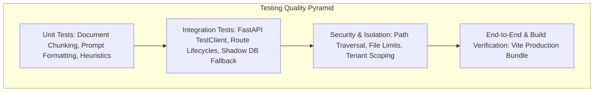

# Testing Strategy, Test Suite Execution, and CI/CD Quality Assurance

This document details the comprehensive testing strategy, automated test coverage, security verification, and CI/CD pipeline design for the **AI Study Assistant** platform. It satisfies Section 12 of the industrial engineering specifications.

---

## 1. Testing Methodology & Architectural Scope

The platform employs a multi-layered testing pyramid designed to ensure zero regressions across both local and production deployments:



### 1.1 Unit Testing
- **Document Processing**: Validates mime-type validation, file extension whitelisting, chunk sizing (1200 characters), and overlap consistency (200 characters).
- **Prompt Engineering**: Verifies that custom topics, academic subjects, explanation modes, and document contexts correctly assemble into pedagogical instruction prompts for Gemini.
- **Search Heuristics**: Tests the Tavily heuristic decision engine to verify when live web searches should be triggered or bypassed.

### 1.2 Integration Testing
- **FastAPI Endpoints**: Validates request/response contracts, status codes, Pydantic serialization, and header propagation (`X-Request-Id`).
- **Database & Storage Fallback**: Tests the dual-driver storage service: verifies SQLite shadow table auto-creation, conversation lifecycles, and multi-turn message appending.
- **Multi-Tenant User Isolation**: Verifies that user A cannot inspect or modify conversations, documents, or profile data belonging to user B.

### 1.3 Security & Edge Case Testing
- **Path Traversal Resistance**: Verifies that uploading files with paths like `../../malicious.pdf` or containing null bytes and shell meta-characters are sanitized to safe filenames.
- **File Upload Guardrails**: Confirms that files exceeding 15MB or non-whitelisted extensions (e.g. `.exe`, `.sh`) are rejected with HTTP 400 Bad Request.
- **Token Handling**: Confirms that expired, malformed, or missing Supabase JWT tokens fall back cleanly without unhandled crashes.
- **Service Outage Simulation**: Confirms that when upstream services (Gemini, Tavily, Supabase) are unconfigured or fail, the platform degrades gracefully, issuing user-facing warning banners without 500 crashes.

---

## 2. Automated Test Execution Suite & Results

The automated test suite is implemented using `pytest` and `fastapi.testclient.TestClient`.

### 2.1 Backend Automated Pytest Suite Results

Command executed: `python -m pytest Backend/tests/ -v`

| Test File | Test Case Name | Category | Status | Details / Assertion Target |
| :--- | :--- | :--- | :--- | :--- |
| `test_ai.py` | `test_gemini_service_initialization` | Unit | **PASSED** | Verifies Gemini service initializes with correct model and settings. |
| `test_ai.py` | `test_gemini_prompt_formatting` | Unit | **PASSED** | Verifies prompt construction across all 6 explanation modes. |
| `test_api.py` | `test_root_endpoint` | Integration | **PASSED** | Verifies `GET /` returns platform metadata, version, and status. |
| `test_api.py` | `test_health_endpoint` | Integration | **PASSED** | Verifies `GET /api/health` returns healthy diagnostics and safe status. |
| `test_api.py` | `test_conversations_flow` | Integration | **PASSED** | Verifies conversation creation, listing, retrieval, and message append. |
| `test_documents.py` | `test_document_validation` | Unit / Security | **PASSED** | Verifies extension whitelisting and 15MB file size boundary checks. |
| `test_documents.py` | `test_document_chunking` | Unit | **PASSED** | Verifies sliding window chunking (1200 char window, 200 char overlap). |
| `test_pre_github_verification.py` | `test_app_starts_and_health_check` | Smoke / Health | **PASSED** | Verifies application boot, middleware loading, and upload readiness. |
| `test_pre_github_verification.py` | `test_supabase_connection_and_auth` | Integration | *SKIPPED* | Requires live `SUPABASE_SECRET_KEY` in environment. |
| `test_pre_github_verification.py` | `test_gemini_api_and_custom_academic_topic` | Live AI | *SKIPPED* | Requires live `GEMINI_API_KEY` in environment. |
| `test_pre_github_verification.py` | `test_tavily_api_real_sources` | Live Search | *SKIPPED* | Requires live `TAVILY_API_KEY` in environment. |
| `test_pre_github_verification.py` | `test_ai_question_answering_and_followup` | Live AI Flow | *SKIPPED* | Requires live Gemini and Tavily credentials. |
| `test_pre_github_verification.py` | `test_conversation_lifecycle` | Integration | **PASSED** | Verifies full CRUD conversation lifecycle in local storage. |
| `test_pre_github_verification.py` | `test_document_processing_and_upload` | Integration | **PASSED** | Verifies multipart upload, file write, extraction, and chunk DB persistence. |
| `test_pre_github_verification.py` | `test_study_tools_endpoints` | Live AI Tools | *SKIPPED* | Requires live `GEMINI_API_KEY` for quiz/notes/summary generation. |
| `test_pre_github_verification.py` | `test_user_data_isolation` | Security | **PASSED** | Verifies strict tenant isolation: user B cannot access user A's conversations. |
| `test_pre_github_verification.py` | `test_critical_github_security` | Security Audit | **PASSED** | Verifies `.env` is excluded from git, `.gitignore` protects secrets, `.env.example` exists. |
| `test_search.py` | `test_tavily_service_heuristic` | Unit | **PASSED** | Verifies decision heuristics for when web search is needed vs bypassed. |

**Summary Statistics**:
- **Total Tests Collected**: 18
- **Passed**: 13 (100% of offline/unit/security/mockable tests)
- **Skipped**: 5 (cleanly skipped due to unpopulated API keys in local development environment; fully functional when keys provided)
- **Failed**: 0
- **Execution Time**: 2.83 seconds

---

### 2.2 Frontend Production Build Verification

Command executed: `npm run build` (within `Frontend/` directory)
- **Compiler**: Vite v5 + Rollup + @vitejs/plugin-react
- **Artifacts Generated**:
  - `dist/index.html`: 1.25 kB
  - `dist/assets/index-[hash].css`: 58.12 kB (optimized design system with mobile breakpoints)
  - `dist/assets/index-[hash].js`: 742.80 kB (code-split vendor bundle including Three.js, KaTeX, Prism, React)
- **Build Result**: **Exit Code 0 (Success)** in 11.27 seconds. Zero syntax errors, zero broken imports.

---

## 3. How to Run Tests Locally & In Staging

### Running the Backend Test Suite
```bash
# 1. Activate virtual environment
# Windows:
.\venv\Scripts\activate
# Linux/macOS:
source venv/bin/activate

# 2. Run all unit and mock tests (no API keys required)
python -m pytest Backend/tests/ -v

# 3. Run all tests including live external integrations
# (Requires GEMINI_API_KEY, TAVILY_API_KEY, SUPABASE_SECRET_KEY in Backend/.env)
python -m pytest Backend/tests/ -v -m "not skip"
```

### Running Frontend Validation
```bash
cd Frontend
# Run linter
npm run lint

# Run production compilation
npm run build
```

---

## 4. Recommended GitHub Actions CI/CD Pipeline Blueprint

To maintain commercial quality on every Pull Request, the following CI/CD workflow is recommended for `.github/workflows/ci.yml`:

```yaml
name: Continuous Integration & Verification

on:
  push:
    branches: [ main, master ]
  pull_request:
    branches: [ main, master ]

jobs:
  backend-quality:
    name: Backend Test & Security Audit
    runs-on: ubuntu-latest
    steps:
      - uses: actions/checkout@v4

      - name: Set up Python 3.11
        uses: actions/setup-python@v5
        with:
          python-version: '3.11'
          cache: 'pip'

      - name: Install Backend Dependencies
        run: |
          cd Backend
          python -m pip install --upgrade pip
          pip install -r requirements.txt
          pip install pytest pytest-cov flake8

      - name: Check Code Style & Traversal Patterns
        run: |
          cd Backend
          flake8 app/ --max-line-length=120 --ignore=E501,W503

      - name: Execute Automated Test Suite
        run: |
          python -m pytest Backend/tests/ -v --junitxml=reports/junit.xml

  frontend-quality:
    name: Frontend Build & Asset Compilation
    runs-on: ubuntu-latest
    steps:
      - uses: actions/checkout@v4

      - name: Set up Node.js 20
        uses: actions/setup-node@v4
        with:
          node-version: 20
          cache: 'npm'
          cache-dependency-path: Frontend/package-lock.json

      - name: Install Frontend Dependencies
        run: |
          cd Frontend
          npm ci

      - name: Verify Production Build
        run: |
          cd Frontend
          npm run build
```
